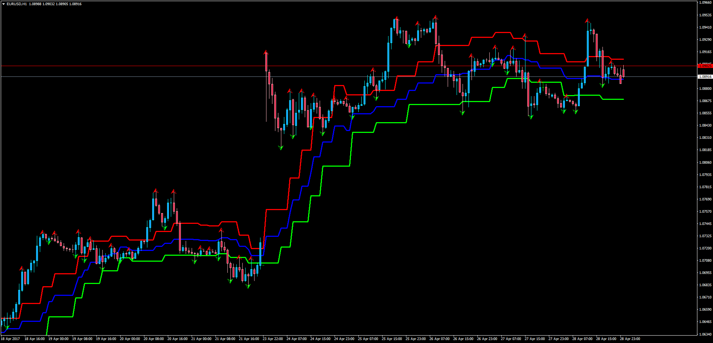

# Advanced Fractal Envelopes

> Source: https://fxcodebase.com/code/viewtopic.php?f=38&t=64633  
> Forum: 38 · Topic 64633 · 6 post(s)

---

## Advanced Fractal Envelopes

**Apprentice** · Mon May 01, 2017 3:38 am

Advanced Fractal Envelopes

LUA Original: [viewtopic.php?f=17&t=10478](https://fxcodebase.com/code/viewtopic.php?f=17&t=10478)

Description:

This is the MT4 version of the LUA Original "Advanced Fractal Envelops which are calculated as the average of a defined number of fractals.

 [Advanced_Fractal_Envelopes.mq4](files/112227/Advanced_Fractal_Envelopes.mq4)

---

## Re: Advanced Fractal Envelopes

**ramzam** · Wed Jun 14, 2017 9:49 pm

i have one fractalmod indicator but when ever i use i am getting failure results and loss making trades..

---

## Re: Advanced Fractal Envelopes

**ramzam** · Wed Jun 14, 2017 9:53 pm

I ATTACHED INDICATOR BUT UNABLE TO ATTACH FILE FOR PIC. PLEASE CONSIDER THIS REQUEST

---

## Re: Advanced Fractal Envelopes

**256robertm** · Thu Jul 13, 2023 10:28 am

Can alert be created for when price closes above or below the envelopes red/green lines?

---

## Re: Advanced Fractal Envelopes

**Apprentice** · Thu Jul 20, 2023 2:25 pm

We have added your request to the development list.
Development reference 633.

---

## Re: Advanced Fractal Envelopes

**Apprentice** · Wed Jul 26, 2023 11:36 am

[Advanced_Fractal_Envelopes+alert.mq4](files/151814/Advanced_Fractal_Envelopesalert.mq4)

Try this version.
