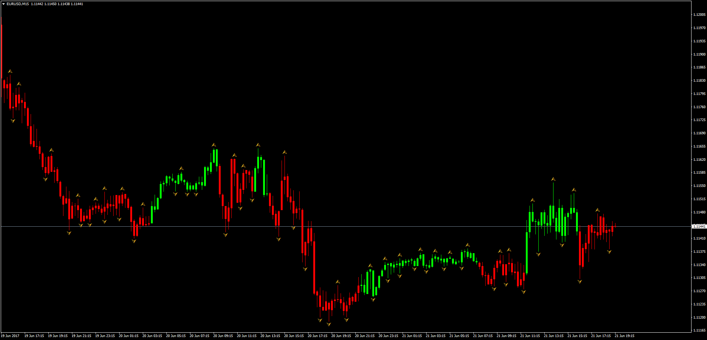

# Advanced Fractal Overlay

> Source: https://fxcodebase.com/code/viewtopic.php?f=38&t=64816  
> Forum: 38 · Topic 64816 · 1 post(s)

---

## Advanced Fractal Overlay

**Apprentice** · Wed Jun 21, 2017 3:17 pm

Description:
This is a request to convert the LUA original to MT4.
[viewtopic.php?f=17&t=724](https://fxcodebase.com/code/viewtopic.php?f=17&t=724)
Changes in trend are registered as follows.

Up Trend: The closing price is higher than the Up-fractal.
Down Trend: The closing price is lower than the Down fractal.

 [Advanced_Fractal_Overlay.mq4](files/113015/Advanced_Fractal_Overlay.mq4)
