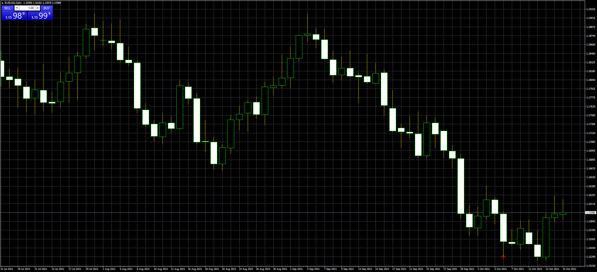

# Advanced_Fractal_Trend_Overlay

> Source: https://fxcodebase.com/code/viewtopic.php?f=38&t=71576  
> Forum: 38 · Topic 71576 · 3 post(s)

---

## Advanced_Fractal_Trend_Overlay

**Apprentice** · Sat Oct 16, 2021 5:45 am

Based on the request.
[https://fxcodebase.com/code/viewtopic.p ... 16#p143816](https://fxcodebase.com/code/viewtopic.php?f=17&p=143816#p143816)

 [Advanced_Fractal_Trend_Overlay.mq4](files/143959/Advanced_Fractal_Trend_Overlay.mq4)

---

## Re: Advanced_Fractal_Trend_Overlay

**richard85** · Thu Oct 28, 2021 8:21 am

> **Apprentice wrote:**
>
>
> The attachment **eurusd-d1-fxcm-australia-pty.png** is no longer available
>
>
> Based on the request.
> [https://fxcodebase.com/code/viewtopic.p ... 16#p143816](https://fxcodebase.com/code/viewtopic.php?f=17&p=143816#p143816)
>
>
> The attachment **eurusd-d1-fxcm-australia-pty.png** is no longer available

thank you!
i have one problem:
the indicator is only showin this on my chart (picture attached)

---

## Re: Advanced_Fractal_Trend_Overlay

**Apprentice** · Sun Oct 31, 2021 3:40 am

Your request is added to the development list.
Development reference 953.
