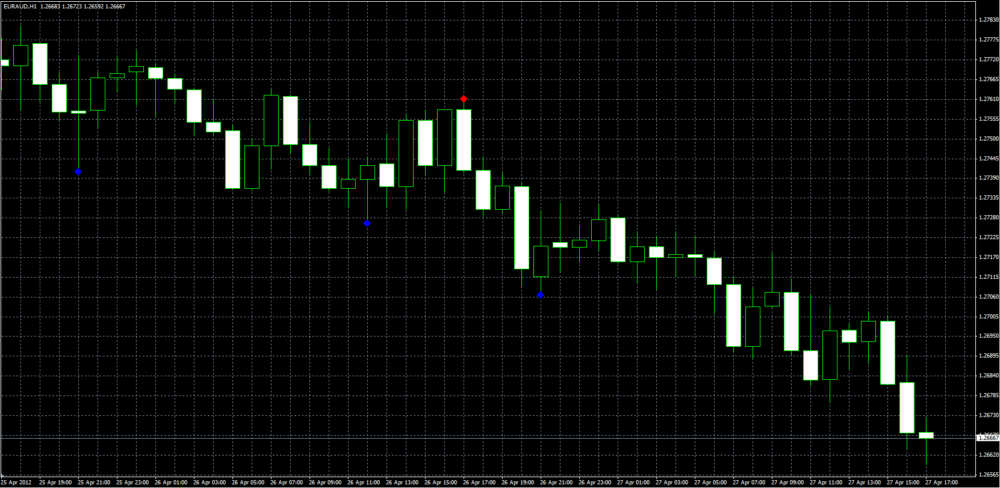

# Advanced Fractal

> Source: https://fxcodebase.com/code/viewtopic.php?f=38&t=17244  
> Forum: 38 · Topic 17244 · 7 post(s)

---

## Advanced Fractal

**Alexander.Gettinger** · Fri Apr 27, 2012 12:34 pm

Original indicator: [viewtopic.php?f=17&t=724](https://fxcodebase.com/code/viewtopic.php?f=17&t=724)

 

To determine the fractal is used (2*Frames+1) candles. The central candle should be higher/lower than [Frame] right-hand and [Frame] left-hand candles.

Download:

 [AdvancedFractals.mq4](files/31580/AdvancedFractals.mq4)

 [AdvancedFractals EA.mq4](files/31580/AdvancedFractals%20EA.mq4)

---

## Re: Advanced Fractal

**Pierce32** · Sat Sep 07, 2019 12:02 pm

Is there an expert advisor for this indicator? It works when I add it to the live chart but when I tried to make an expert advisor out of it using iCustom it didn't work. Thanks.

---

## Re: Advanced Fractal

**Apprentice** · Tue Sep 10, 2019 8:04 am

Your request is added to the development list.
Development reference 61.

---

## Re: Advanced Fractal

**Apprentice** · Wed Sep 11, 2019 6:03 am

EA Added.
The indicator had a bug.
EA will not work with the previous version.

---

## Re: Advanced Fractal

**antoniadisnikolaos** · Tue Apr 14, 2020 1:53 pm

HI
THANKS FOR THE INDICATOR
BUT IT IS THE SAME INDICATOR THAT HAS THE MT4 AS DEFAULT.
I DISCRIBED A DIFFERENT ONE
HIGH FRACTAL=IN 3 BARS THE MIDDLE BAR HAS THE HIGHER VAULE AND THE ONE BAR ON THE LEFT AND ONE BAR ON THE RIGHT HAS LOWER HIGH
VIA VERSA FOR LOW FRACTAL

IF WE HAVE OUT SIDE BAR ON THE MIDDLE BAR I MUST SEE A BLUE DOT ON THE HIGH AND A RED DOT ON THE LOW IN THE SAME BAR

THANKS

---

## Re: Advanced Fractal

**Apprentice** · Wed Apr 15, 2020 1:18 pm

Your request is added to the development list.
Development reference 1070.

---

## Re: Advanced Fractal

**Apprentice** · Wed Apr 22, 2020 11:06 am

It uses the algorithm you have described.
