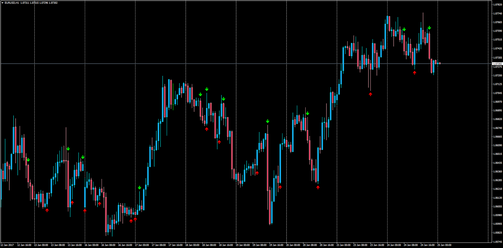

# Advanced Fractals on Moving Average with Alerts

> Source: https://fxcodebase.com/code/viewtopic.php?f=38&t=64330  
> Forum: 38 · Topic 64330 · 1 post(s)

---

## Advanced Fractals on Moving Average with Alerts

**Apprentice** · Wed Jan 25, 2017 5:09 am

LUA Original: [viewtopic.php?f=17&t=2617](https://fxcodebase.com/code/viewtopic.php?f=17&t=2617)

Description:

This version of fractals searches maximums and minimums MA using extended variant of MA.

Alerts: A new sound and/or email alert is showing if the trader decides to have one everytime a new fractal appears on the current bar.

 [Advanced_Fractal_On_MA.mq4](files/110687/Advanced_Fractal_On_MA.mq4)
