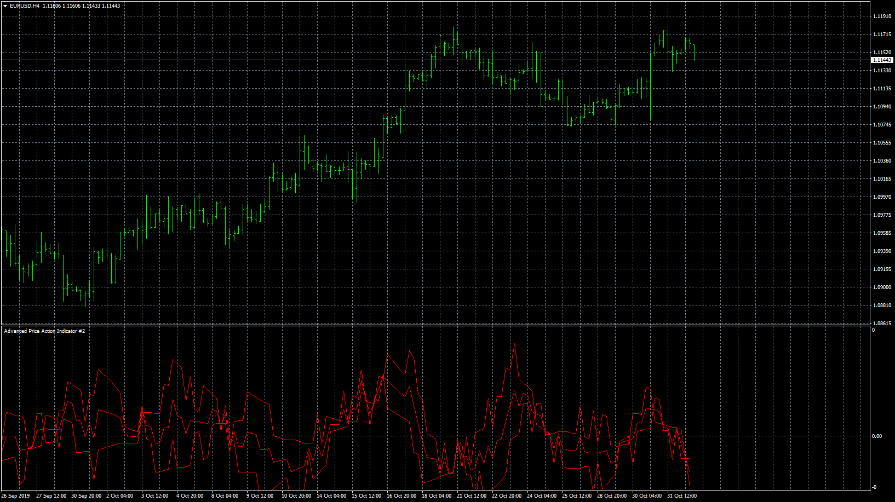

# Advanced_Price_Action_Indicator

> Source: https://fxcodebase.com/code/viewtopic.php?f=38&t=69079  
> Forum: 38 · Topic 69079 · 4 post(s)

---

## Advanced_Price_Action_Indicator

**Apprentice** · Fri Nov 01, 2019 7:32 am

Based on request.
[viewtopic.php?f=27&t=69069](https://fxcodebase.com/code/viewtopic.php?f=27&t=69069)

 [Advanced_Price_Action_Indicator.mq4](files/129524/Advanced_Price_Action_Indicator.mq4)

---

## Re: Advanced_Price_Action_Indicator

**ahmedalhosenyy** · Tue Nov 28, 2023 10:21 am

Nice indicator

Any chance for LUA version

thanks

---

## Re: Advanced_Price_Action_Indicator

**Apprentice** · Tue Nov 28, 2023 10:53 am

We have added your request to the development list.
Development reference 1053

---

## Re: Advanced_Price_Action_Indicator

**Apprentice** · Tue Nov 28, 2023 2:00 pm

TS2 version.
[https://fxcodebase.com/code/viewtopic.php?f=17&t=74383](https://fxcodebase.com/code/viewtopic.php?f=17&t=74383)
