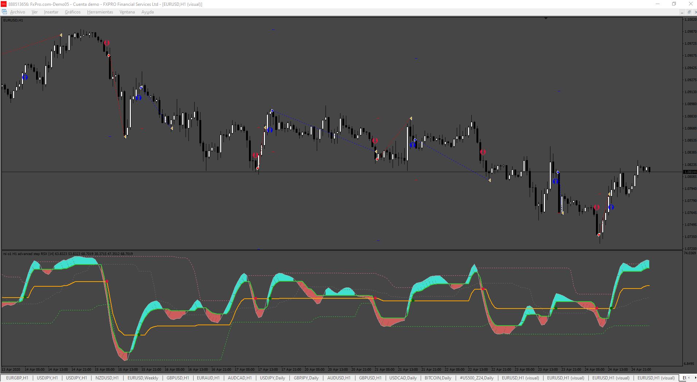
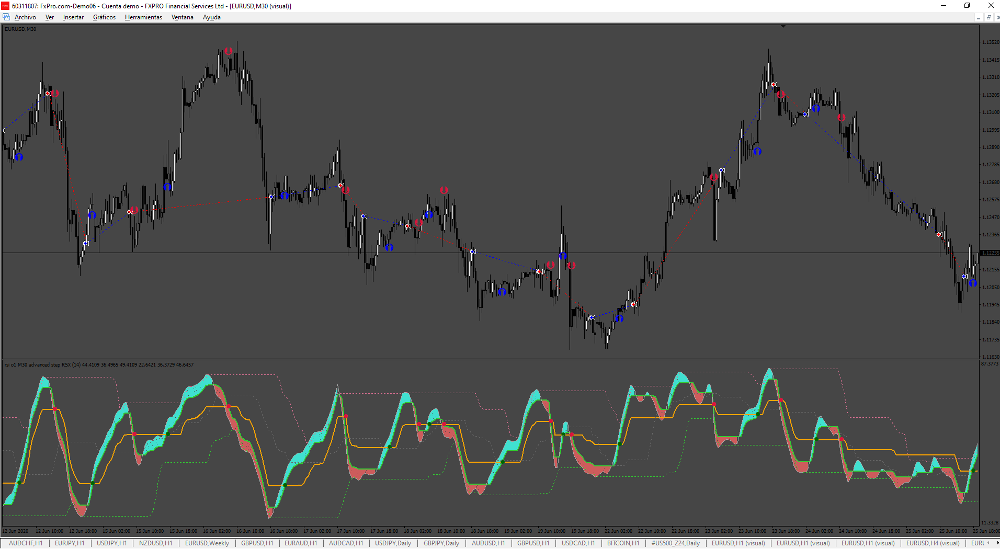

# Advanced_Step_RSX

> Source: https://fxcodebase.com/code/viewtopic.php?f=38&t=75423  
> Forum: 38 · Topic 75423 · 4 post(s)

---

## Advanced_Step_RSX

**Apprentice** · Fri Dec 13, 2024 4:03 pm

Based on the request.
[https://fxcodebase.com/code/viewtopic.p ... 41#p157441](https://fxcodebase.com/code/viewtopic.php?f=27&p=157441#p157441)

 [! Advanced Dz Step RSI (mtf + alerts +arrows).ex4](files/157540/Advanced%20Dz%20Step%20RSI%20%28mtf%20alerts%20arrows%29.ex4)

 [Advanced_Step_RSX.mq4](files/157540/Advanced_Step_RSX.mq4)

---

## Re: Advanced_Step_RSX

**trtrader** · Fri Dec 13, 2024 8:00 pm

Thanks, Admin,

Could you please add:

- Close by opposite signal for both modes separately.

- EMA filter that uses the crossing of 2 EMAs 50 and 100 by default

---

## Re: Advanced_Step_RSX

**Apprentice** · Wed Dec 18, 2024 4:41 am

We have added your request to the development list.
Development reference 925

---

## Re: Advanced_Step_RSX

**Apprentice** · Sat Dec 21, 2024 11:37 am

 [Advanced_Step_RSX V2.mq4](files/157587/Advanced_Step_RSX%20V2.mq4)
