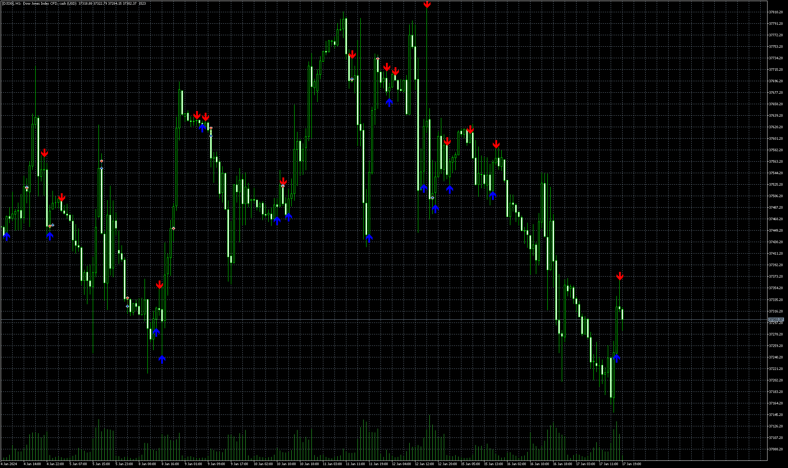

# adx-buy-sell

> Source: https://fxcodebase.com/code/viewtopic.php?f=38&t=74727  
> Forum: 38 · Topic 74727 · 4 post(s)

---

## adx-buy-sell

**Apprentice** · Mon Mar 25, 2024 10:43 am

Based on the request.
[https://fxcodebase.com/code/viewtopic.php?f=27&p=154012](https://fxcodebase.com/code/viewtopic.php?f=27&p=154012)

 [adx-buy-sell.mq5](files/154812/adx-buy-sell.mq5)

---

## Re: adx-buy-sell

**LeboMM** · Sat Jun 15, 2024 9:13 am

Thank you for taking your time to assist, I really appreciate it. The mq5 indicator is repainting, it's not supposed to repaint or redraw.

---

## Re: adx-buy-sell

**Apprentice** · Sun Jun 16, 2024 9:34 am

We have added your request to the development list.
Development reference 498

---

## Re: adx-buy-sell

**Apprentice** · Tue Jun 18, 2024 1:17 pm

Try this version.

 [adx-buy-sell_v2.mq5](files/155798/adx-buy-sell_v2.mq5)
