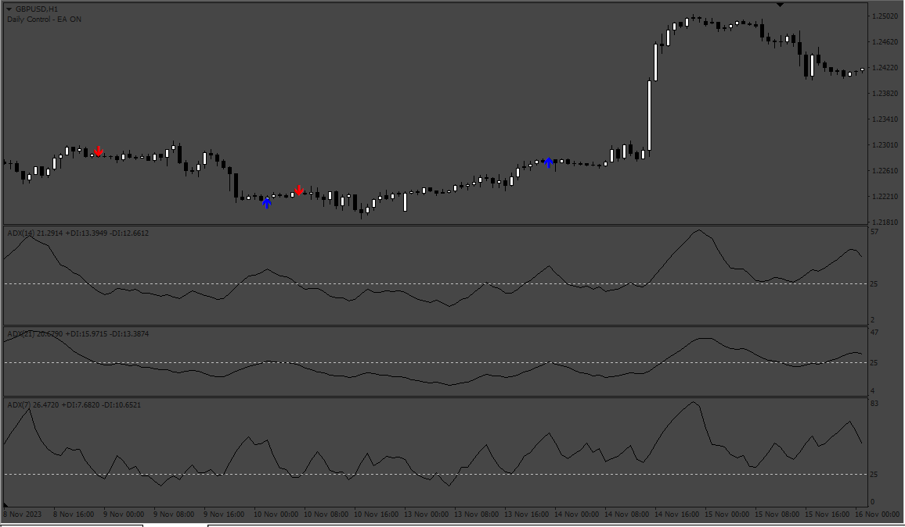
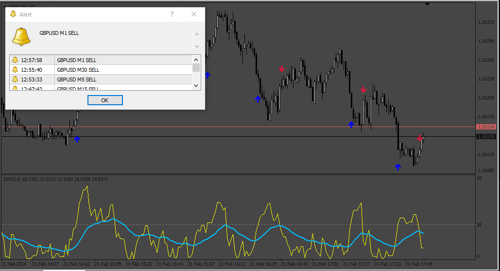
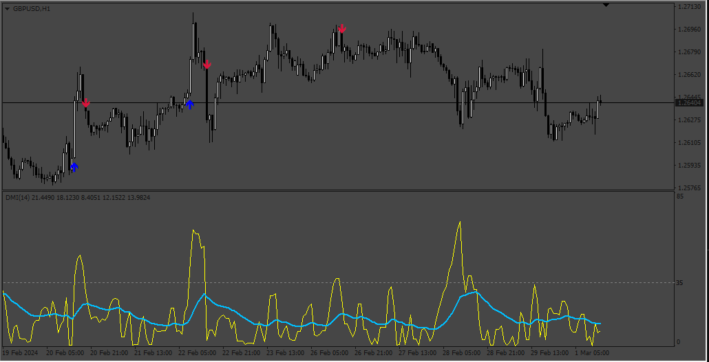
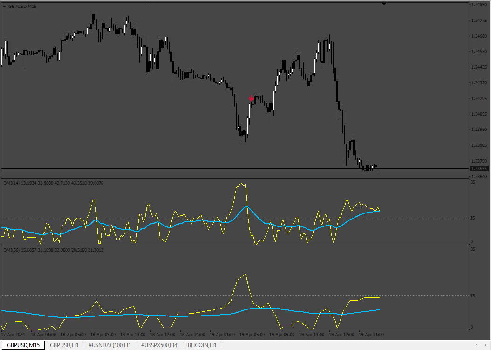

# ADX_Crosing_Signals

> Source: https://fxcodebase.com/code/viewtopic.php?f=38&t=74364  
> Forum: 38 · Topic 74364 · 9 post(s)

---

## ADX_Crosing_Signals

**Apprentice** · Fri Nov 24, 2023 3:30 am

Based on the request.
[https://fxcodebase.com/code/viewtopic.php?f=27&p=153311](https://fxcodebase.com/code/viewtopic.php?f=27&p=153311)

 [ADX_Crosing_Signals.mq4](files/153390/ADX_Crosing_Signals.mq4)

---

## Re: ADX_Crosing_Signals

**Teruyoshi** · Thu Jan 18, 2024 4:50 am

Dear, teacher apprentice.
Coud you turn this indi into mtf and add alert on current and notification via e-mail when DX (not adx) crosses above 35 line and under?
Also when each cross occurs, I want the arrows that can be choosen on code bases to be put on 35line.
 I greatly appreciate your heip and generousity. Many thanks in advance.

---

## Re: ADX_Crosing_Signals

**Apprentice** · Sat Jan 20, 2024 4:10 am

We have added your request to the development list.
Development reference 74

---

## Re: ADX_Crosing_Signals

**Apprentice** · Sat Feb 24, 2024 1:29 pm

 [Wilder8s_ADX.mq4](files/154478/Wilder8s_ADX.mq4)

---

## Re: ADX_Crosing_Signals

**Teruyoshi** · Mon Feb 26, 2024 11:41 pm

Thanks for sharing. I have chacked the indi and found it nees a littel modification because in my strategy, Dx 35 line Up cross does not always mean the candle go up, vice versa. So, I changed the alert messages a little by myself but i am not a coder.
 Could you modify the arrows so that they apper on 35 line (subwindows) as I request above?
Many thanks in advance.

---

## Re: ADX_Crosing_Signals

**Apprentice** · Thu Feb 29, 2024 5:16 am

We have added your request to the development list.
Development reference 191

---

## Re: ADX_Crosing_Signals

**Apprentice** · Sun Mar 03, 2024 7:12 am

 [Wilder8s_ADX.mq4](files/154566/Wilder8s_ADX.mq4)

---

## Re: ADX_Crosing_Signals

**Teruyoshi** · Mon Mar 11, 2024 12:59 am

I hesitate to say that there seems to be no MTF funciton.
Could you add?
Many thanks in advance.

---

## Re: ADX_Crosing_Signals

**Apprentice** · Mon Apr 22, 2024 9:37 am

 [Wilder8s_ADX_mtf.mq4](files/155072/Wilder8s_ADX_mtf.mq4)
