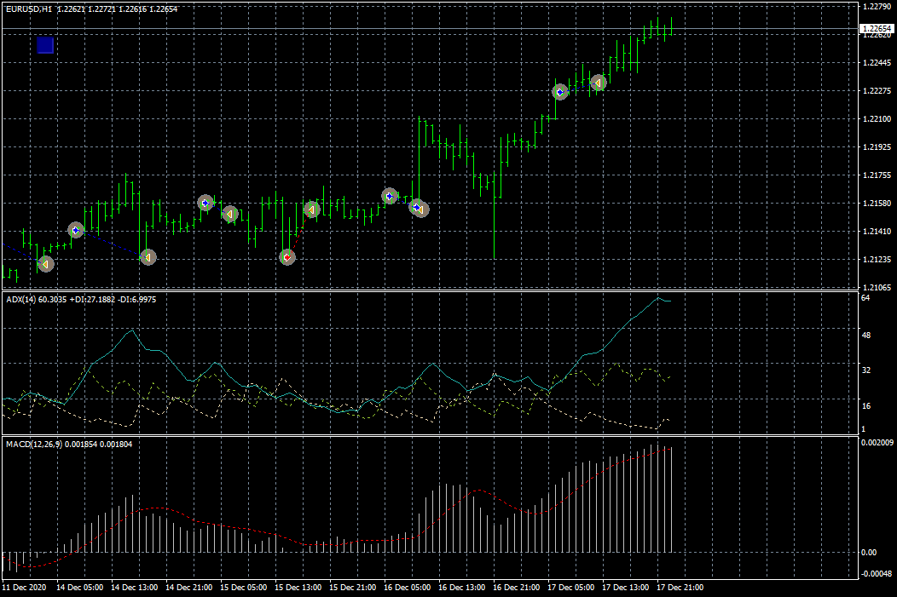
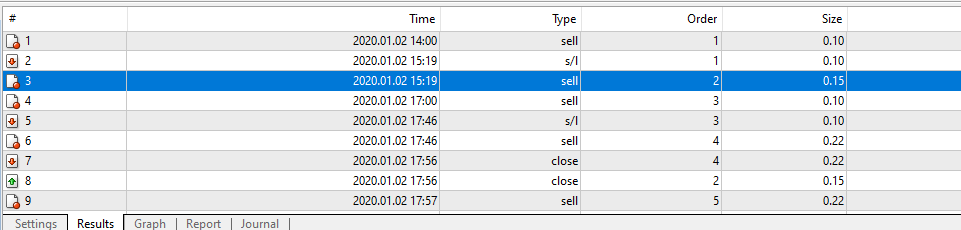
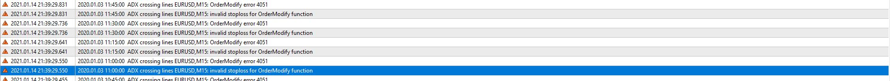
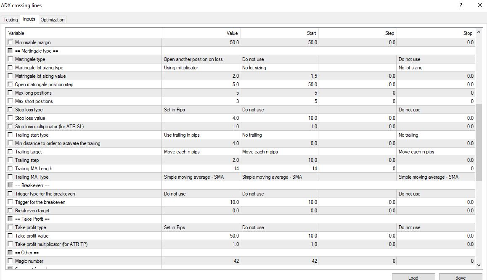
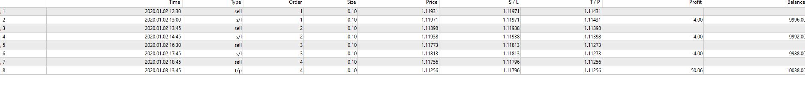
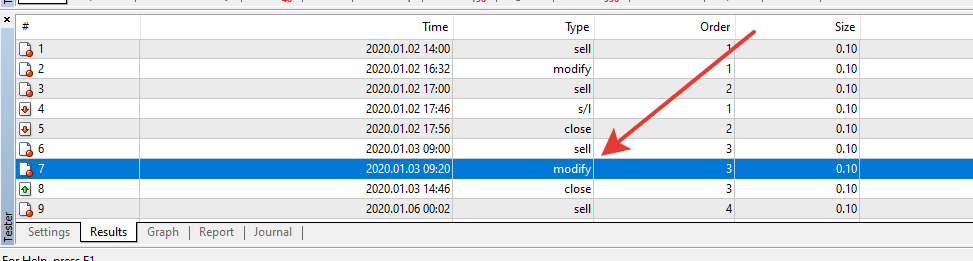
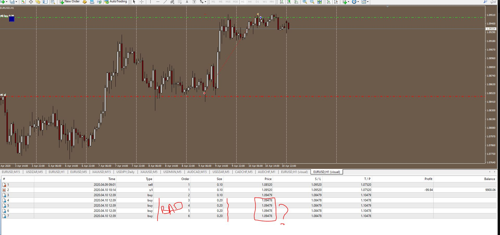
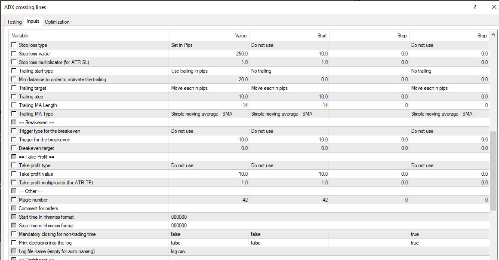
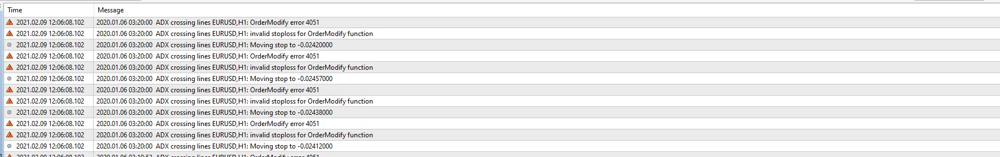

# ADX crossing lines EA

> Source: https://fxcodebase.com/code/viewtopic.php?f=38&t=70783  
> Forum: 38 · Topic 70783 · 20 post(s)

---

## ADX crossing lines EA

**Apprentice** · Tue Jan 05, 2021 8:57 am

Based on request.
[viewtopic.php?f=27&t=70777](https://fxcodebase.com/code/viewtopic.php?f=27&t=70777)

 [ADX crossing lines.mq4](files/140014/ADX%20crossing%20lines.mq4)

---

## Re: ADX crossing lines EA

**tannos** · Tue Jan 05, 2021 9:45 am

Dear Apprentice,

First of all, I want to thank you for the work you have done on the site. And I take this beginning of the month to wish you a happy new year. Abundance, happiness, and peace in a new year filled with hope.
I have a few remarks on the robot you made for me
1) Martingale doesn't work. I set Martingale type to "Open another position on loss" and martingale lot type to "using multiplicator" but It don't open any position.
This is how it should work: If price goes against you, then EA will put on another order of the same type at set distance, I call these recovery trades, until it reaches a max number of recovery trades
When the martingale is on, each subsequent position opens with an increased volume of ' Coefficient '. I gave the rules in my request.

2) Trailing stop doesn't work even if StopLoss is set.
It should work even if StopLoss not set.

3) There are a lof features I asked missing.

Can you fix it please.

---

## Re: ADX crossing lines EA

**Apprentice** · Wed Jan 06, 2021 11:37 am

Your request is added to the development list.
Development reference 40.

---

## Re: ADX crossing lines EA

**Apprentice** · Sun Jan 10, 2021 2:33 am

I don't have any issues with trailing.
Trailing need the stop order in order to work. It doesn't know what distance it should keep otherwise.
The same with martingale. It works without any issues

 

 

---

## Re: ADX crossing lines EA

**tannos** · Thu Jan 14, 2021 3:47 pm

Hi Apprentice
I tested it again and I stil have bug with trailing stop and martingale
Have a look on the following pictures and tell me what i'm doing more.

 

 

 

Besides this is how the martingale should work
If price goes against you, then EA will put on another order of the same type at set distance, I call these recovery trades, until it reaches a max number of recovery trades
When the martingale is on, each subsequent position opens with an increased volume of ' Coefficient '. I gave the rules in my request.

---

## Re: ADX crossing lines EA

**Apprentice** · Fri Jan 15, 2021 6:29 am

Your request is added to the development list.
Development reference 81.

---

## Re: ADX crossing lines EA

**Apprentice** · Mon Jan 25, 2021 1:55 pm

Your stop loss is too close.

---

## Re: ADX crossing lines EA

**tannos** · Thu Jan 28, 2021 6:54 pm

Hi Apprentice,

I changed my settings:

Stop loss tipe : in pips
Stop loss value : 200
Trialing type: in pips
Min distance to activate trailing : 20
Trailing target: move each n pips
Trailing step: 10

And I still have the same issues. So, if it work for you, send me a screenshot of your parameters.

And what about the martingale. I described how it should work

---

## Re: ADX crossing lines EA

**Apprentice** · Fri Jan 29, 2021 10:01 am

Your request is added to the development list.
Development reference 127.

---

## Re: ADX crossing lines EA

**Apprentice** · Tue Feb 02, 2021 12:47 pm

I've checked using your parameters. It works as expected

---

## Re: ADX crossing lines EA

**tannos** · Wed Feb 03, 2021 3:18 am

Hi Apprentice,

I disabled trailing and martingale and I tested each feature one by one.

**Trailing is not working**
2021.02.03 09:04:09.270	2020.04.09 10:26:10 ADX crossing lines EURUSD,H1: invalid stoploss for OrderModify function
2021.02.03 09:04:09.267	2020.04.09 10:26:10 ADX crossing lines EURUSD,H1: OrderModify error 4051

**There is a bug in Martingaile. Look by your self**

 

2021.02.03 09:09:04.953	2020.04.10 12:39:15 ADX crossing lines EURUSD,H1: open #6 buy 0.20 EURUSD at 1.09478 sl: 1.08478 tp: 1.10478 ok
2021.02.03 09:09:04.949	2020.04.10 12:39:15 ADX crossing lines EURUSD,H1: open #5 buy 0.20 EURUSD at 1.09478 sl: 1.08478 tp: 1.10478 ok
2021.02.03 09:09:04.949	2020.04.10 12:39:13 ADX crossing lines EURUSD,H1: open #4 buy 0.20 EURUSD at 1.09479 sl: 1.08479 tp: 1.10479 ok
2021.02.03 09:09:04.949	2020.04.10 12:39:11 ADX crossing lines EURUSD,H1: open #3 buy 0.20 EURUSD at 1.09478 sl: 1.08478 tp: 1.10478 ok2021.02.03 09:09:04.751	2020.04.10 10:14:54
2021.02.03 09:09:04.949	2020.04.10 12:39:09 ADX crossing lines EURUSD,H1: open #2 buy 0.10 EURUSD at 1.09479 sl: 1.08479 tp: 1.10479 ok Tester: stop loss #1 at 1.09520 (1.09518 / 1.09520)
2021.02.03 09:09:00.508	2020.04.09 09:01:16 ADX crossing lines EURUSD,H1: open #1 sell 0.10 EURUSD at 1.08520 sl: 1.09520 tp: 1.07520 ok

Can you fix these bugs please and make the martingale work the way I requested please

---

## Re: ADX crossing lines EA

**Apprentice** · Thu Feb 04, 2021 7:39 am

Your request is added to the development list.
Development reference 144.

---

## Re: ADX crossing lines EA

**Apprentice** · Sat Feb 06, 2021 10:57 am

> invalid stoploss for OrderModify function

It's not a bug. Your broker refuses to move the stop loss as requested by trailing code. There is nothing we can do with that. Try to keep larger distance. Or your broker doesn't support some of the operations. Do you have an EA with trailing working on your account? Added logs
Found and fixed issue with martingale

---

## Re: ADX crossing lines EA

**tannos** · Tue Feb 09, 2021 6:15 am

> **Apprentice wrote:**
>
>
> > invalid stoploss for OrderModify function
>
>
>
> It's not a bug. Your broker refuses to move the stop loss as requested by trailing code. There is nothing we can do with that. Try to keep larger distance. Or your broker doesn't support some of the operations. Do you have an EA with trailing working on your account? Added logs
> Found and fixed issue with martingale

Hi Apprentice
I am not sure the problem is about my broker. I'm on FBS and to answer to your question, yes I have other EA that works fine (trailing stop, breakeven and martingale)

My settings

 

The errors logs

 

I did it like you requested: use a larger distance and the result is the same.
Can you fix it please

> **Apprentice wrote:**
> Found and fixed issue with martingale

Where can I find the new version please

---

## Re: ADX crossing lines EA

**Apprentice** · Sun Feb 14, 2021 3:05 am

I need the code of your EA then

---

## Re: ADX crossing lines EA

**tannos** · Mon Feb 15, 2021 10:54 am

> **Apprentice wrote:**
> I need the code of your EA then

I am using your code sir. It's the first link on this post [http://fxcodebase.com/code/download/file.php?id=31739](https://fxcodebase.com/code/download/file.php?id=31739)

---

## Re: ADX crossing lines EA

**Apprentice** · Tue Feb 16, 2021 2:41 pm

Your request is added to the development list.
Development reference 199.

---

## Re: ADX crossing lines EA

**tannos** · Sun Mar 07, 2021 3:54 pm

Hi Apprentice
Any news of my request ?

---

## Re: ADX crossing lines EA

**tannos** · Mon Mar 29, 2021 4:17 pm

Hi apprentice
3weeks ago I sent to you a request and I'm still waiting

---

## Re: ADX crossing lines EA

**Apprentice** · Fri May 14, 2021 4:56 am

[ADX_crossing_lines.mq4](files/142087/ADX_crossing_lines.mq4)

Try this version.
