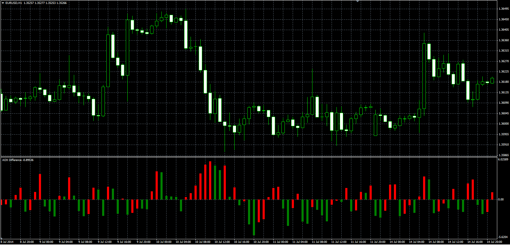

# ADX Difference

> Source: https://fxcodebase.com/code/viewtopic.php?f=38&t=61045  
> Forum: 38 · Topic 61045 · 1 post(s)

---

## ADX Difference

**Alexander.Gettinger** · Mon Aug 18, 2014 1:45 pm

Original LUA oscillator: [viewtopic.php?f=17&t=33851](https://fxcodebase.com/code/viewtopic.php?f=17&t=33851).

Formula:
ADX Difference[i] = ADX[i]-ADX[i-Difference], where
ADX - Average Directional Movement Index with [Length] as number of periods.

 

Download:

 [ADX_Difference.mq4](files/95409/ADX_Difference.mq4)
