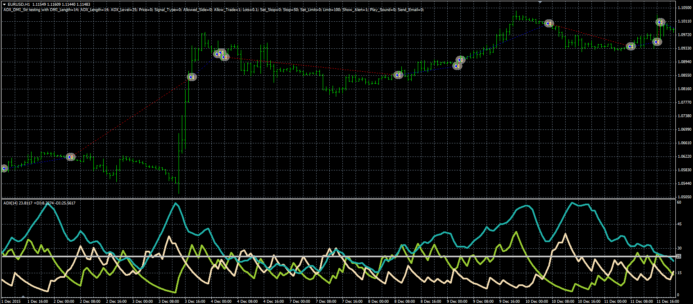

# ADX DMI strategy

> Source: https://fxcodebase.com/code/viewtopic.php?f=38&t=63586  
> Forum: 38 · Topic 63586 · 1 post(s)

---

## ADX DMI strategy

**Alexander.Gettinger** · Thu Jun 09, 2016 5:12 pm

The strategy based on the ADX indicator.

Buy condition: (ADX crosses above ADX_Level with DMI(+)>DMI(-)) or (DMI(+) crosses above DMI(-) with ADX>ADX_Level).
Sell condition: (ADX crosses above ADX_Level with DMI(+)<DMI(-)) or (DMI(+) crosses under DMI(-) with ADX>ADX_Level).

 

Download:

 [ADX_DMI_Str.mq4](files/106704/ADX_DMI_Str.mq4)
