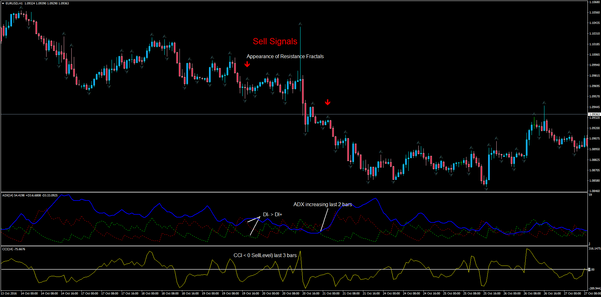

# ADX Fractals Signals

> Source: https://fxcodebase.com/code/viewtopic.php?f=38&t=64087  
> Forum: 38 · Topic 64087 · 1 post(s)

---

## ADX Fractals Signals

**Apprentice** · Fri Nov 11, 2016 12:24 pm

Description:
This indicator will generate historical signals and real time alerts when the following conditions are met:

BUY:
1. ADX IS INCREASING IN PAST 2 BARS
2. DMI POSITIVE> DMI NEGATIVE
3. CCI > BUY LEVEL IN PAST 3 BARS
4. APPEARANCE OF NEW SUPPORT FRACTAL(DOWN FRACTAL)

SELL:
1. ADX IS INCREACING IN PAST 2 BARS
2. DMI NEGATIVE> DMI POSITIVE
3. CCI < SELL LEVEL IN PAST 3 BARS
4. APPEARANCE OF NEW RESISTANCE FRACTAL(UP FRACTAL)

Please note that the present indicator does the calculations and display the Buy/Sell Signals, but since there are indicators being used in separate windows and the main chart, a visual representation cannot be provided due to platform restrictions. This means the user needs to attach each of the indicators (ADX, CCI and Fractals - the 3 of them within the MT4 default indicators) to visualize what the alerts are telling.

 [ADX_Fractal_Signals.mq4](files/109009/ADX_Fractal_Signals.mq4)
