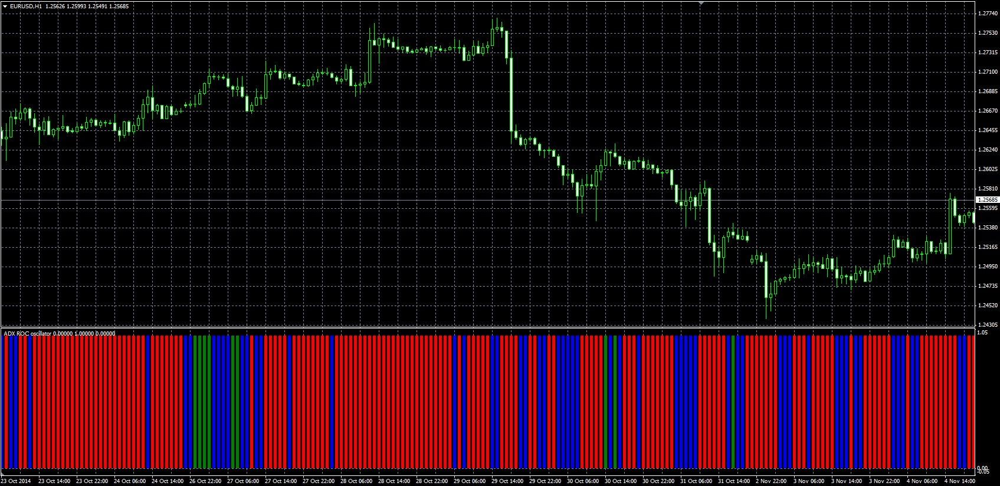
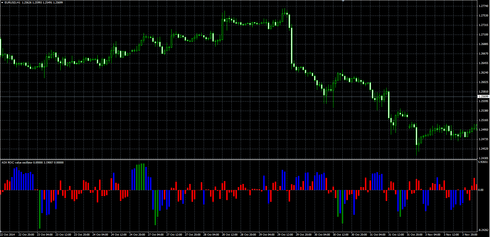

# ADX ROC Oscillator

> Source: https://fxcodebase.com/code/viewtopic.php?f=38&t=61499  
> Forum: 38 · Topic 61499 · 9 post(s)

---

## ADX ROC Oscillator

**Alexander.Gettinger** · Thu Nov 20, 2014 5:45 pm

Original LUA oscillators: [viewtopic.php?f=17&t=7485](https://fxcodebase.com/code/viewtopic.php?f=17&t=7485).

**ADX ROC Oscillator:**

 

Download:

 [ADX_ROC_Oscillator.mq4](files/97235/ADX_ROC_Oscillator.mq4)

**ADX ROC Value Oscillator:**

 

Download:

 [ADX_ROC_Value_Oscillator.mq4](files/97235/ADX_ROC_Value_Oscillator.mq4)

Wilders DMI version.
[viewtopic.php?f=38&t=65625&p=116994#p116994](https://fxcodebase.com/code/viewtopic.php?f=38&t=65625&p=116994#p116994)

---

## Re: ADX ROC Oscillator

**nookie** · Wed Sep 30, 2015 8:04 am

Hello, for this version ADX_ROC_Oscillator.mq4 I think its either something not working with the algorithm or can it be made the following:

BarUP if (ADX - (ADX-1) ) >5.0 all else is ignored

---

## Re: ADX ROC Oscillator

**nookie** · Thu Oct 01, 2015 5:40 am

For ADX_ROC_Value_Oscillator.mq4 a small change is needed, can the - (minus) values (when ADX is sloping down) to be removed from display in a version ?

---

## Re: ADX ROC Oscillator

**Apprentice** · Thu Oct 08, 2015 4:59 am

Your request is added to the development list.

---

## Re: ADX ROC Oscillator

**nookie** · Wed Jan 10, 2018 5:49 am

If possible this ADX ROC should make calculations based on the Wilders DMI [viewtopic.php?f=27&t=63034](https://fxcodebase.com/code/viewtopic.php?f=27&t=63034)

and not use the integrated ADX in MT4, is it possible ?

---

## Re: ADX ROC Oscillator

**Apprentice** · Thu Jan 11, 2018 7:48 am

Your request is added to the development list under Id Number 4005

---

## Re: ADX ROC Oscillator

**Apprentice** · Fri Jan 12, 2018 6:20 am

Try this version.
[viewtopic.php?f=38&t=65625&p=116994#p116994](https://fxcodebase.com/code/viewtopic.php?f=38&t=65625&p=116994#p116994)

---

## Re: ADX ROC Oscillator

**isamegrelo** · Tue Aug 14, 2018 5:54 pm

what means green line? sell or buy?

---

## Re: ADX ROC Oscillator

**Apprentice** · Wed Aug 15, 2018 5:21 am

ADX Rate of change is greater then Fast_Level.
The rate of change is the difference between current ADX value and ADX value N candles/periods ago.
