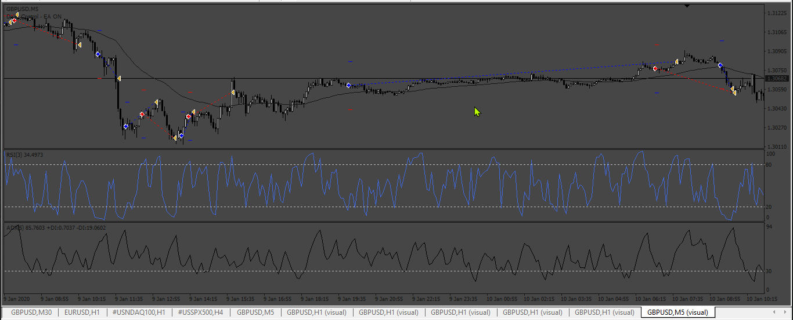
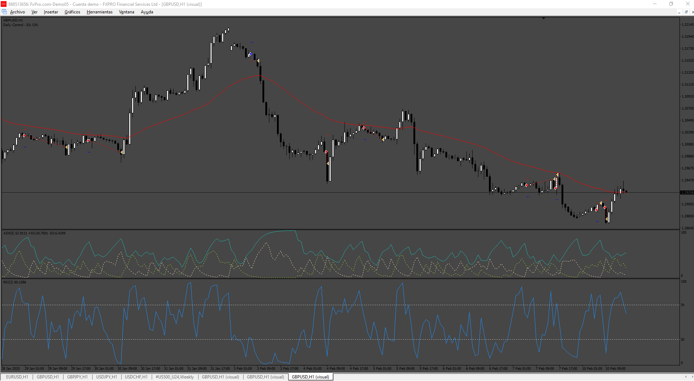
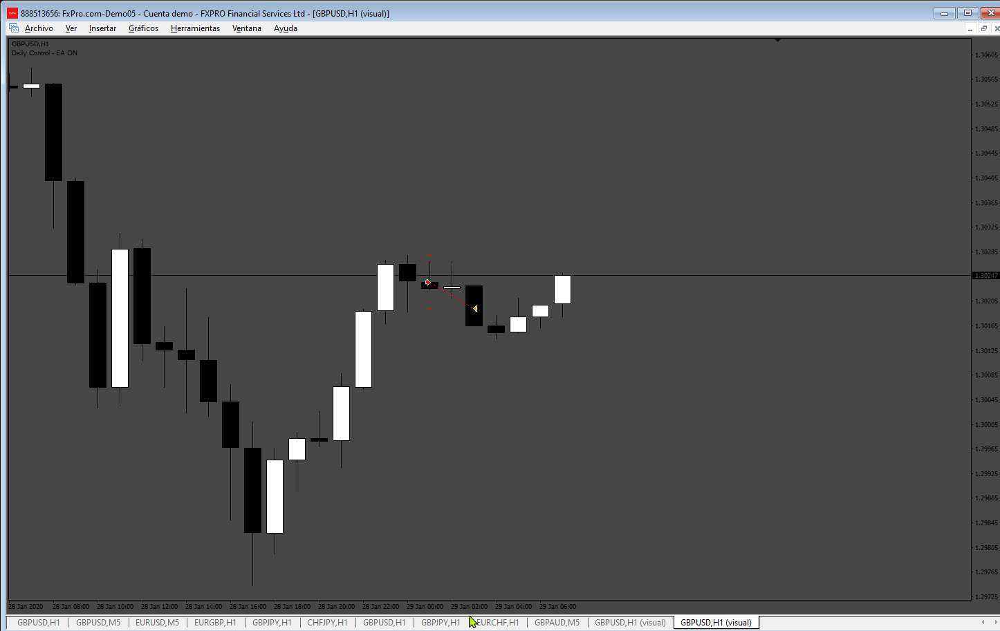

# ADX_RSI_EMA_EA

> Source: https://fxcodebase.com/code/viewtopic.php?f=38&t=74824  
> Forum: 38 · Topic 74824 · 11 post(s)

---

## ADX_RSI_EMA_EA

**Apprentice** · Mon Apr 29, 2024 10:06 am

Based on the request.
[https://fxcodebase.com/code/viewtopic.p ... 32#p155132](https://fxcodebase.com/code/viewtopic.php?f=27&p=155132#p155132)

 [ADX_RSI_EMA_EA.mq4](files/155187/ADX_RSI_EMA_EA.mq4)

---

## Re: ADX_RSI_EMA_EA

**mobilefanatik** · Tue Apr 30, 2024 7:42 am

I noticed that the martingale multiplier with a value lower than 1.5 does not work, it only places orders of 0.01. (I'm interested in the martingale multiplier working with values lower than 1.5, for example the value of 1.2, which is much safer). The martingale additioner option is missing.
Thank you very much for your help!

---

## Re: ADX_RSI_EMA_EA

**Apprentice** · Tue May 14, 2024 9:36 am

Here is the review of the EA.

---

## Re: ADX_RSI_EMA_EA

**Mijail Vargas** · Mon Aug 26, 2024 12:23 am

It will be possible to modify this code?, I have this modification:

Long
Entry Criteria
Price above the 50 period EMA
ADX above 30
Previous candle's RSI below 20, current candle's RSI above 20

Short
Entry Criteria
Price below the 50 period EMA
ADX above 30
Previous candle's RSI above 80, current candle's RSI below 80

Operation input:
- Long
Open a long order at the opening of the signal candle, condition = the candle before the signal must be green

- Short
Open a short order at the opening of the signal candle, condition = the candle before the signal must be red

- Stop Loss
1. It must be equal to the minimum of the previous candle if it is a buy or the maximum of the previous candle if it is a sell.

2. If this low is less than 5 ticks, do not make the entry, but this option must be disabled or enabled

- Take profit On/Off
Once the price reaches 1 to 1 place the order on BE and continue using trailing stop.

Thank you very much for your collaboration!

---

## Re: ADX_RSI_EMA_EA

**Apprentice** · Mon Aug 26, 2024 6:13 pm

We have added your request to the development list.
Development reference 677

---

## Re: ADX_RSI_EMA_EA

**Apprentice** · Sun Sep 01, 2024 3:52 pm

 [ADX_RSI_EMA_EA_v2.0.mq4](files/156556/ADX_RSI_EMA_EA_v2.0.mq4)

---

## Re: ADX_RSI_EMA_EA

**Mijail Vargas** · Sun Sep 01, 2024 10:56 pm

Hi
When I place 0 in Pips SL the entry does not place SL in the order, and the TP should be 1: 1, attached images.
Thanks.

---

## Re: ADX_RSI_EMA_EA

**Mijail Vargas** · Tue Sep 03, 2024 12:49 pm

> **Apprentice wrote:**
>
>
> The attachment **677.png** is no longer available
>
>
>
>
> The attachment **677.png** is no longer available

Hi,
I checked the operation but I observed:
1. the SL at 0 pips removes the SL it should be SL=previous candle
2. the TP should be 1:1 but there is no that option.
I attached images

---

## Re: ADX_RSI_EMA_EA

**Mijail Vargas** · Thu Sep 26, 2024 11:19 am

Hi Apprentice,
could you check what I mentioned?
Thanks and regards

---

## Re: ADX_RSI_EMA_EA

**Apprentice** · Tue Oct 01, 2024 5:43 am

We have added your request to the development list.
Development reference 752

---

## Re: ADX_RSI_EMA_EA

**Apprentice** · Sun Oct 06, 2024 3:16 am

 [ADX_RSI_EMA_EA_v3.0.mq4](files/156889/ADX_RSI_EMA_EA_v3.0.mq4)
