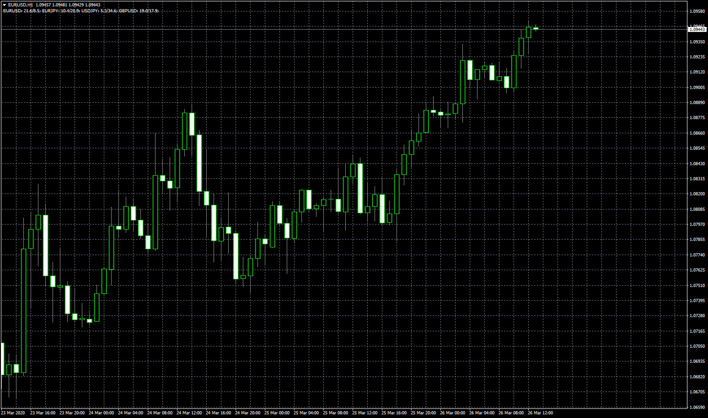

# ADX strenght meter / DMI strenght meter

> Source: https://fxcodebase.com/code/viewtopic.php?f=38&t=69581  
> Forum: 38 · Topic 69581 · 8 post(s)

---

## ADX strenght meter / DMI strenght meter

**Apprentice** · Thu Mar 26, 2020 6:54 am

Based on request.
[viewtopic.php?f=27&t=69561](https://fxcodebase.com/code/viewtopic.php?f=27&t=69561)

 [ADX strenght meter.mq4](files/132295/ADX%20strenght%20meter.mq4)

 [DMI strenght meter.mq4](files/132295/DMI%20strenght%20meter.mq4)

---

## Re: ADX strenght meter / DMI strenght meter

**jusiur** · Thu Apr 09, 2020 10:46 pm

Dear apprentice, very useful indicators. Is it possible to modify them so that they display the information in a sub-window and are displayed in the form of lines as in the example? thanks

---

## Re: ADX strenght meter / DMI strenght meter

**Apprentice** · Fri Apr 10, 2020 6:59 am

Your request is added to the development list.
Development reference 1044.

---

## Re: ADX strenght meter / DMI strenght meter

**Apprentice** · Fri Apr 17, 2020 4:50 am

[ADX strenght meter Oscillator.mq4](files/132910/ADX%20strenght%20meter%20Oscillator.mq4)

 [DMI strenght meter Oscillator.mq4](files/132910/DMI%20strenght%20meter%20Oscillator.mq4)

---

## Re: ADX strenght meter / DMI strenght meter

**jusiur** · Fri Apr 17, 2020 10:02 am

Thank you so much

---

## Re: ADX strenght meter / DMI strenght meter

**jusiur** · Wed Apr 29, 2020 1:02 pm

In this order of ideas and seeing the value of the previous tools, would it be possible to make a modification so that it shows CURRECIES and not the pairs please? Thank for your help.

---

## Re: ADX strenght meter / DMI strenght meter

**Apprentice** · Thu Apr 30, 2020 4:11 am

Your request is added to the development list.
Development reference 1174.

---

## Re: ADX strenght meter / DMI strenght meter

**Apprentice** · Thu May 07, 2020 6:28 am

[ADX strenght meter Currency Oscillator.mq4](files/133661/ADX%20strenght%20meter%20Currency%20Oscillator.mq4)

 [DMI strenght meter Currency Oscillator.mq4](files/133661/DMI%20strenght%20meter%20Currency%20Oscillator.mq4)

Try this version.
