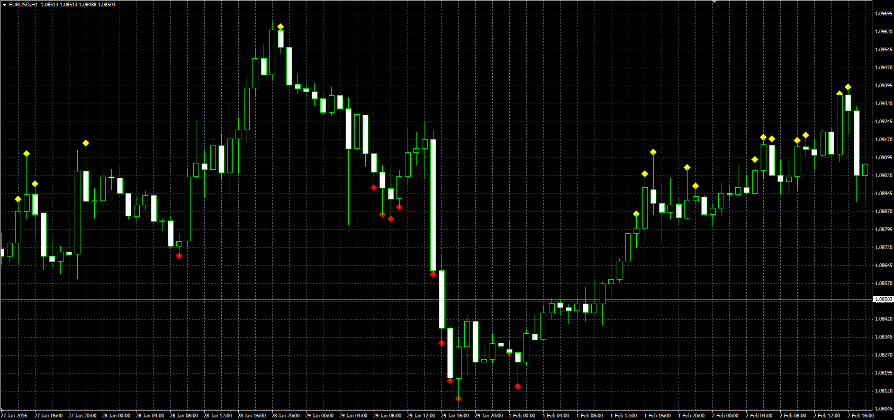

# ADX trend indicator

> Source: https://fxcodebase.com/code/viewtopic.php?f=38&t=63203  
> Forum: 38 · Topic 63203 · 1 post(s)

---

## ADX trend indicator

**Alexander.Gettinger** · Wed Mar 02, 2016 1:48 pm

The indicator analyzes 3 ADX.

Ind[i]=UP, if ADX1[i]>ADX1[i-1] and ADX2[i]>ADX2[i-1] and ADX3[i]>ADX3[i-1] and ADX1[i]>Level1 and ADX2[i]>Level2 and DMI>0,

Ind[i]=DN, if ADX1[i]>ADX1[i-1] and ADX2[i]>ADX2[i-1] and ADX3[i]>ADX3[i-1] and ADX1[i]>Level1 and ADX2[i]>Level2 and DMI<0.

 

Download:

 [ADX_Trend.mq4](files/105066/ADX_Trend.mq4)
