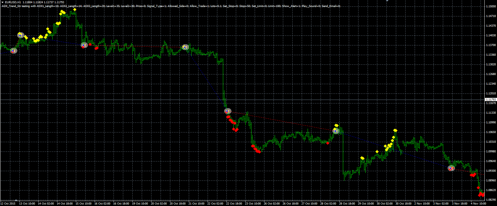

# ADX trend strategy

> Source: https://fxcodebase.com/code/viewtopic.php?f=38&t=63293  
> Forum: 38 · Topic 63293 · 1 post(s)

---

## ADX trend strategy

**Alexander.Gettinger** · Thu Mar 24, 2016 1:23 pm

The strategy based on ADX trend indicator ([viewtopic.php?f=38&t=63203&p=105066](https://fxcodebase.com/code/viewtopic.php?f=38&t=63203&p=105066)).

Buy condition: first buy signal from the indicator.
Sell condition: first sell signal from the indicator.

 

Download:

 [ADX_Trend_Str.mq4](files/105447/ADX_Trend_Str.mq4)

ADX trend indicator ([viewtopic.php?f=38&t=63203&p=105066](https://fxcodebase.com/code/viewtopic.php?f=38&t=63203&p=105066)) should be installed for correct work.
