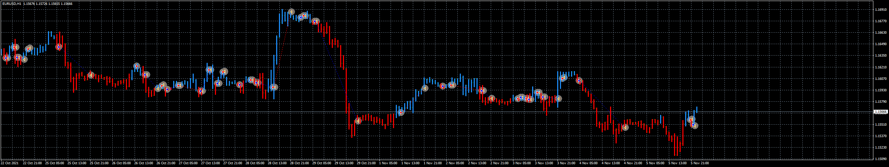
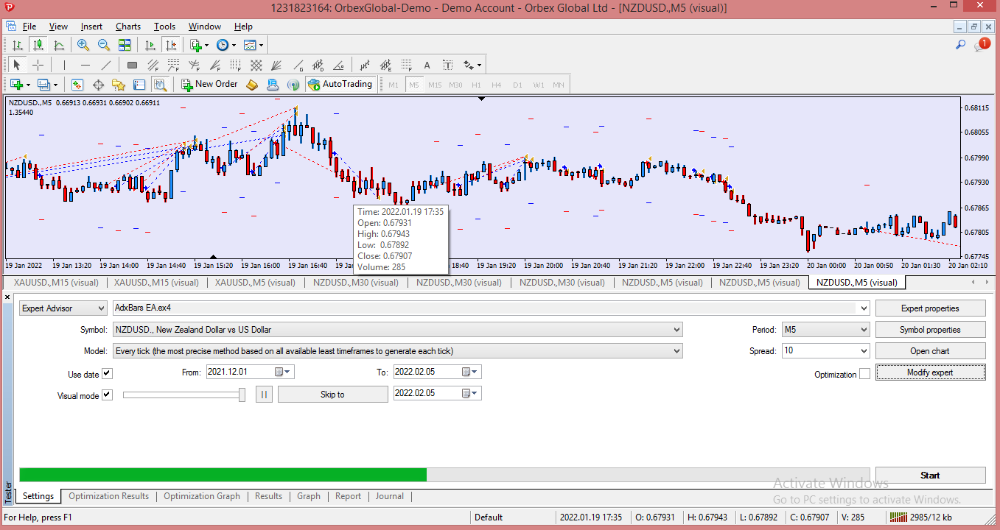

# AdxBars_EA

> Source: https://fxcodebase.com/code/viewtopic.php?f=38&t=71813  
> Forum: 38 · Topic 71813 · 7 post(s)

---

## AdxBars_EA

**Apprentice** · Mon Jan 24, 2022 6:44 am

Based on the request.
[https://fxcodebase.com/code/viewtopic.p ... 50#p144650](https://fxcodebase.com/code/viewtopic.php?f=27&p=144650#p144650)

 [ADXbars.mq4](files/144822/ADXbars.mq4)

 [AdxBars_EA.mq4](files/144822/AdxBars_EA.mq4)

---

## Re: AdxBars_EA

**papaprabu** · Thu Feb 03, 2022 9:45 pm

dear apprentice..
im sorry but i did backtest and there was no open order

---

## Re: AdxBars_EA

**Apprentice** · Sat Feb 05, 2022 8:49 am

1. Step:- First Put Indicator (ADXbars ) in Indicator Folder ( Compile it )
2. Step:- Then Test it on Strategy Tester.
I hope it is working for you,
Please send me your feedback,

---

## Re: AdxBars_EA

**papaprabu** · Thu Feb 10, 2022 6:12 am

> **Apprentice wrote:**
>
>
> Adx_Bars_Testing.png
>
>
> 1. Step:- First Put Indicator (ADXbars ) in Indicator Folder ( Compile it )
> 2. Step:- Then Test it on Strategy Tester.
> I hope it is working for you,
> Please send me your feedback,

thanks it works,,
after i redownload the indicator from here. it works

thanks.
i will share if i found good set

---

## Re: AdxBars_EA

**papaprabu** · Thu Feb 10, 2022 7:00 am

> **Apprentice wrote:**
>
>
> Adx_Bars_Testing.png
>
>
> 1. Step:- First Put Indicator (ADXbars ) in Indicator Folder ( Compile it )
> 2. Step:- Then Test it on Strategy Tester.
> I hope it is working for you,
> Please send me your feedback,

please correct this
open order is wrong. should be the opposite

please also add SHIFT INDICATOR SIGNAL to open order

---

## Re: AdxBars_EA

**Apprentice** · Fri Feb 11, 2022 5:44 am

Your request is added to the development list.
Development reference 87.

---

## Re: AdxBars_EA

**Apprentice** · Sun May 15, 2022 2:18 pm

Try it now.
Please Use the Updated version "ADXbars" indicator
