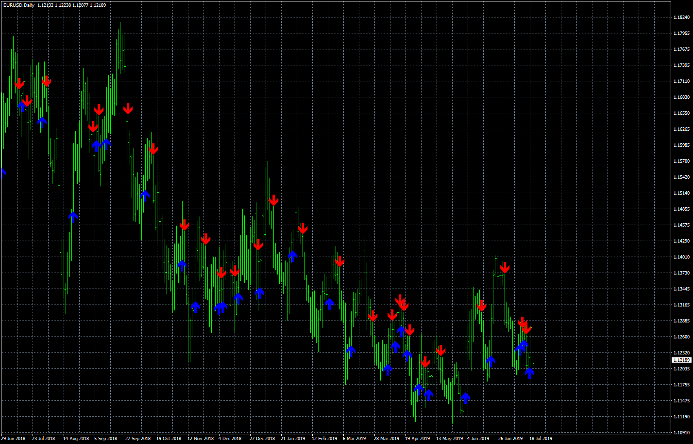
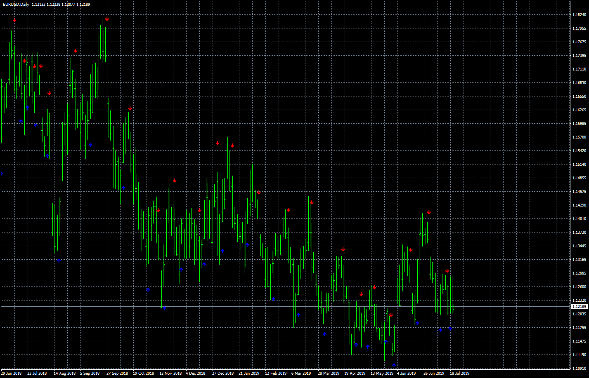

# ADXcrossesNon-repainting

> Source: https://fxcodebase.com/code/viewtopic.php?f=38&t=68737  
> Forum: 38 · Topic 68737 · 4 post(s)

---

## ADXcrossesNon-repainting

**Apprentice** · Fri Aug 02, 2019 3:45 am

Based on request.
[viewtopic.php?f=27&t=68719](https://fxcodebase.com/code/viewtopic.php?f=27&t=68719)

 [@@ADXcrossesNon-repainting.mq4](files/127693/ADXcrossesNon-repainting.mq4)

---

## binarywi

**Apprentice** · Fri Aug 02, 2019 3:46 am

 [binarywi.mq4](files/127694/binarywi.mq4)

---

## Re: ADXcrossesNon-repainting

**nookie** · Sat Aug 17, 2019 2:02 pm

Hello, what is the logic binarywi.mq4 is using ? Is there an article or some page where it explains what it is about ?

---

## Re: ADXcrossesNon-repainting

**Apprentice** · Sun Aug 18, 2019 8:14 am

It was a simple conversion.
Can NOT provide additional information.
