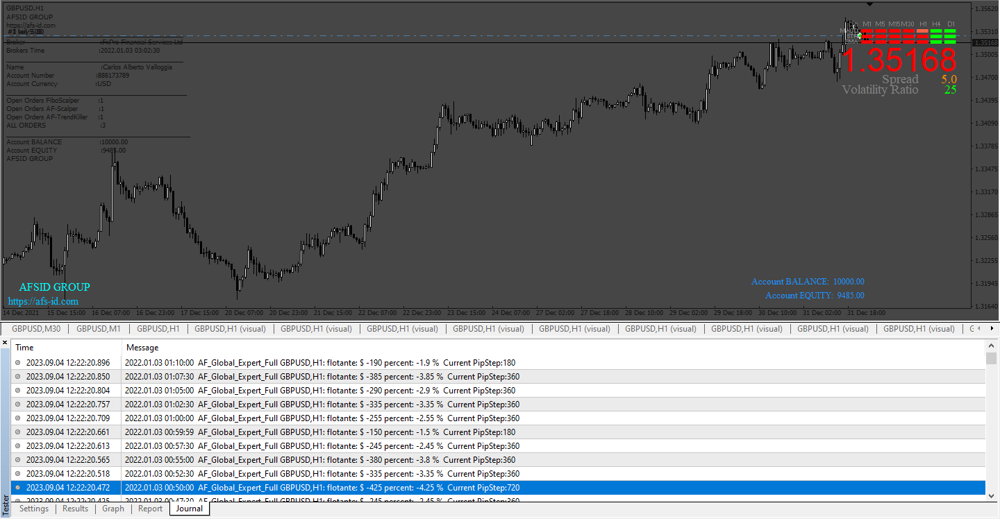
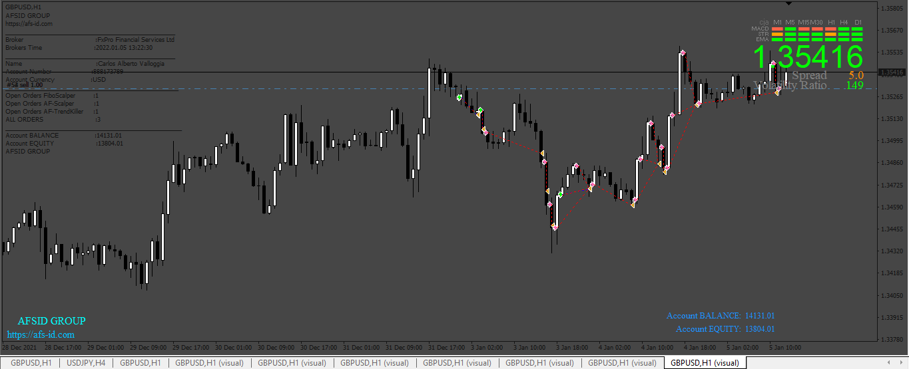

# AF_Global_Expert_Full

> Source: https://fxcodebase.com/code/viewtopic.php?f=38&t=74149  
> Forum: 38 · Topic 74149 · 19 post(s)

---

## AF_Global_Expert_Full

**Apprentice** · Mon Sep 11, 2023 6:29 am

Based on the request.
[https://fxcodebase.com/code/viewtopic.php?f=38&t=74026](https://fxcodebase.com/code/viewtopic.php?f=38&t=74026)

 [AF_Global_Expert_Full.mq4](files/152514/AF_Global_Expert_Full.mq4)

---

## Re: AF_Global_Expert_Full

**Mahadeo1806** · Tue Sep 12, 2023 8:27 pm

Rsi sir

Please add one more option on this file

Close all if 5% Drawdown

Thanking you

---

## Re: AF_Global_Expert_Full

**Apprentice** · Sun Sep 17, 2023 4:30 am

We have added your request to the development list.
Development reference 854.

---

## Re: AF_Global_Expert_Full

**Apprentice** · Sun Sep 24, 2023 4:45 am

 [AF_Global_Expert_Full_v2.mq4](files/152670/AF_Global_Expert_Full_v2.mq4)

---

## Re: AF_Global_Expert_Full

**rajrajan** · Wed Sep 27, 2023 12:24 am

> **Apprentice wrote:**
>
>
> 854.png
>
>
>
>
> AF_Global_Expert_Full_v2.mq4

Dear Apprentice, Please convert this EA to MT5

Thank you for your time

---

## Re: AF_Global_Expert_Full

**Apprentice** · Sat Sep 30, 2023 3:00 am

We have added your request to the development list.
Development reference 886.

---

## Re: AF_Global_Expert_Full

**righvex** · Tue Oct 17, 2023 11:06 pm

> **Apprentice wrote:**
>
>
> 854.png
>
>
>
>
> AF_Global_Expert_Full_v2.mq4

hi Sir.. can you add Drawdown level which can we set? For example, i want the each position not exceeded that particular drawdown that we set. Also add breakeven and stop loss parameter. Tq sir

---

## Re: AF_Global_Expert_Full

**Apprentice** · Sat Oct 21, 2023 9:27 am

We have added your request to the development list.
Development reference 953

---

## Re: AF_Global_Expert_Full

**Apprentice** · Wed Nov 01, 2023 3:58 pm

[AF_Global_Expert_Full_v3.mq4](files/153143/AF_Global_Expert_Full_v3.mq4)

Try this version.

---

## Re: AF_Global_Expert_Full

**righvex** · Wed Nov 01, 2023 8:48 pm

> **Apprentice wrote:**
>
>
> The attachment **AF_Global_Expert_Full_v3.mq4** is no longer available
>
>
> Try this version.

HI Sir, thank you for your effort. Great EA. But it have error after a few moment of backtesting.

---

## Re: AF_Global_Expert_Full

**Apprentice** · Sat Nov 04, 2023 10:42 am

We have added your request to the development list.
Development reference 984

---

## Re: AF_Global_Expert_Full

**gedong.parrot** · Tue Nov 14, 2023 9:45 pm

Hi @apprentice thanks for sharing this, but I noticed that this contained 3 strategies:
1. AF Fibo;
2. AF Scalpler; and
3. AF Trendkiller

in this EA version, all three automatically open trade sometime with the same position, is it possible for us to set only specific strategies that run on specific set?

Thank you

---

## Re: AF_Global_Expert_Full

**gedong.parrot** · Wed Nov 15, 2023 1:13 am

> **Apprentice wrote:**
>
>
> AF_Global_Expert_Full_v3.mq4
>
>
> Try this version.

Hi Apprentice, thanks for all the update, I noticed in this EA we have 3 strategies which are:
1. AF-FIBO;
2. AF-Scalper; and
3. AF-Trendkiller

By default all those 3 strategies on for specific PAIR, could you help to put on/off parameter for specific strategies, so that we can select which one will run for spesific pair?

Thank You,

---

## Re: AF_Global_Expert_Full

**Apprentice** · Fri Nov 17, 2023 5:35 am

We have added your request to the development list.
Development reference 1018

---

## Re: AF_Global_Expert_Full

**jfor88** · Mon May 06, 2024 12:14 pm

possible to view a myfxbook stat?

---

## Re: AF_Global_Expert_Full

**Mahadeo1806** · Mon Jan 13, 2025 10:51 pm

Hi sir

We can change 3order set up to 1order set I want only one order set up in this ea can we change
Please guide h to do this

---

## Re: AF_Global_Expert_Full

**Apprentice** · Wed Feb 05, 2025 3:54 pm

Task 1018

 [AF_Global_Expert_Full.mq4](files/158144/AF_Global_Expert_Full.mq4)

---

## Re: AF_Global_Expert_Full

**Apprentice** · Sat Nov 15, 2025 1:35 pm

Task 984

 [AF_Global_Expert_Full_v4.mq4](files/161216/AF_Global_Expert_Full_v4.mq4)

---

## Re: AF_Global_Expert_Full

**Apprentice** · Mon Dec 29, 2025 7:29 am

Task 886

 [AF_Global_Expert_Full_v4.mq5](files/161440/AF_Global_Expert_Full_v4.mq5)
