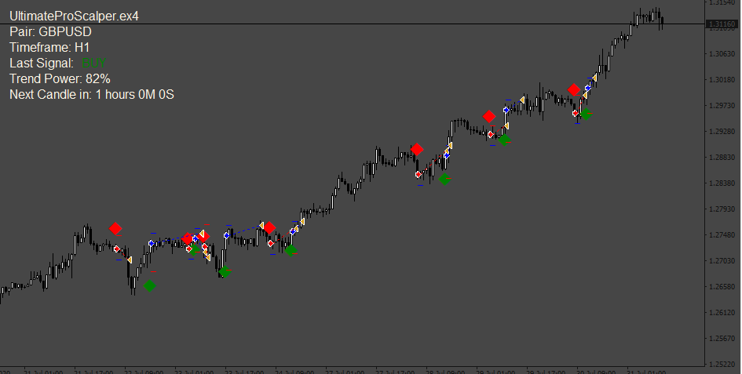

# AgenteMolder EA

> Source: https://fxcodebase.com/code/viewtopic.php?f=38&t=71933  
> Forum: 38 · Topic 71933 · 3 post(s)

---

## AgenteMolder EA

**Apprentice** · Thu Mar 03, 2022 12:45 pm

Based on the request.
[https://fxcodebase.com/code/viewtopic.php?f=38&p=145181](https://fxcodebase.com/code/viewtopic.php?f=38&p=145181)
I can't take the value of the "power trend meter" from the indicator ( haven't this buffer) so this param was not included.

 [Market_Sessions.ex4](files/145224/Market_Sessions.ex4)

 [UltimateProScalper.ex4](files/145224/UltimateProScalper.ex4)

 [AgenteMolder EA.mq4](files/145224/AgenteMolder%20EA.mq4)

---

## Re: AgenteMolder EA

**AgenteMolder** · Fri Mar 04, 2022 4:09 am

I see that it works excellent for you but it throws me this error, what should it be? I searched for a solution but I don't understand it

2022.03.04 06:03:30.914	2021.04.28 10:30:00 cannot open file 'C:\Users\HP\AppData\Roaming\MetaQuotes\Terminal\F354DCCD667FB40D8D6DE5A4406D8652\MQL4\indicators\UltimateProScalper.ex4' [2]

---

## Re: AgenteMolder EA

**Apprentice** · Wed Mar 09, 2022 11:46 am

I can't see well the error in the picture, but probably is this:
need to have the indicator called "UltimateProScalper.ex4" in the folder "Indicators" in MetaTrader platform
