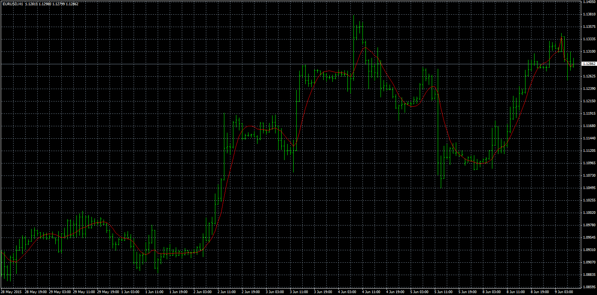
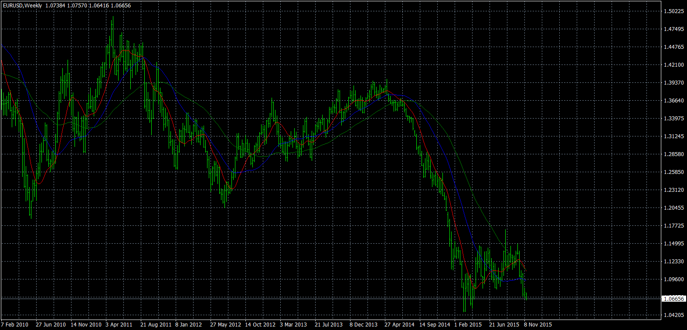

# Ahrens Moving Average

> Source: https://fxcodebase.com/code/viewtopic.php?f=38&t=62628  
> Forum: 38 · Topic 62628 · 3 post(s)

---

## Ahrens Moving Average

**Apprentice** · Fri Sep 04, 2015 6:37 am

Based on the request.
[viewtopic.php?f=27&t=62626](https://fxcodebase.com/code/viewtopic.php?f=27&t=62626)

 [AhrensMovingAverage.mq4](files/102166/AhrensMovingAverage.mq4)

 

 [3in1_AhrensMovingAverage.mq4](files/102166/3in1_AhrensMovingAverage.mq4)

---

## Re: Ahrens Moving Average

**gpiero** · Fri Sep 04, 2015 7:18 am

Apprentice, it would have taken me way too long to figure out what I did wrong. You have been exceptionally helpful and you deserve all the credit that you get. Thank you so much.

---

## Re: Ahrens Moving Average

**Apprentice** · Sun Apr 17, 2016 5:29 am

3in1_AhrensMovingAverage.mq4 Added.
