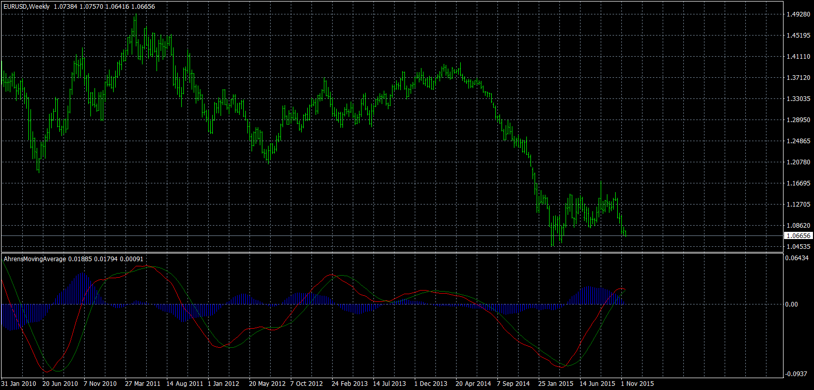

# AhrensMovingAverageConvergenceDivergence

> Source: https://fxcodebase.com/code/viewtopic.php?f=38&t=63383  
> Forum: 38 · Topic 63383 · 1 post(s)

---

## AhrensMovingAverageConvergenceDivergence

**Apprentice** · Fri Apr 15, 2016 1:13 pm

MACD is calculated based on AhrensMovingAverage.
[viewtopic.php?f=38&t=62628](https://fxcodebase.com/code/viewtopic.php?f=38&t=62628)

 [AhrensMovingAverageConvergenceDivergence.mq4](files/105813/AhrensMovingAverageConvergenceDivergence.mq4)
