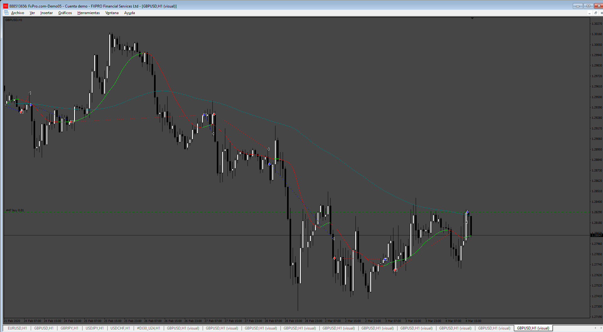
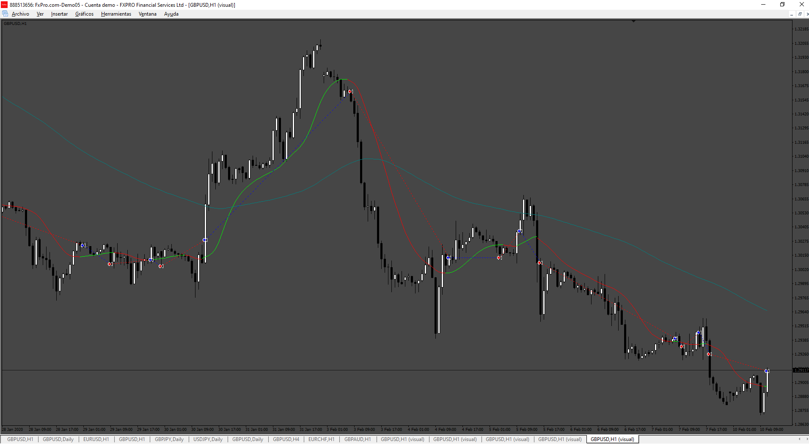
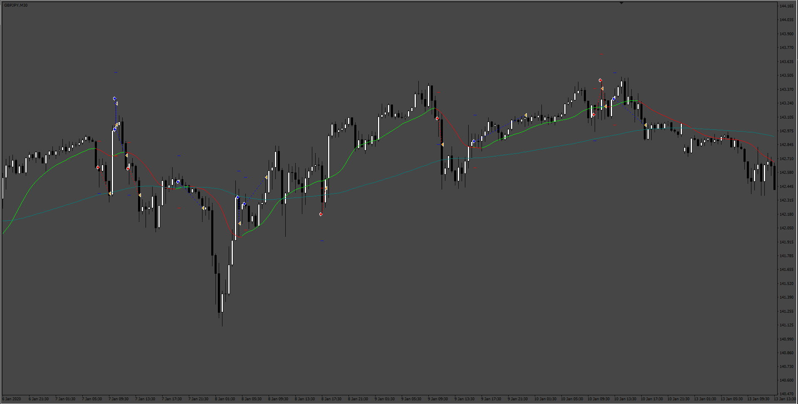
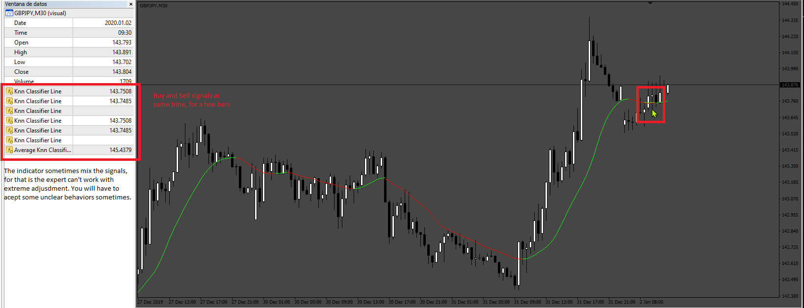
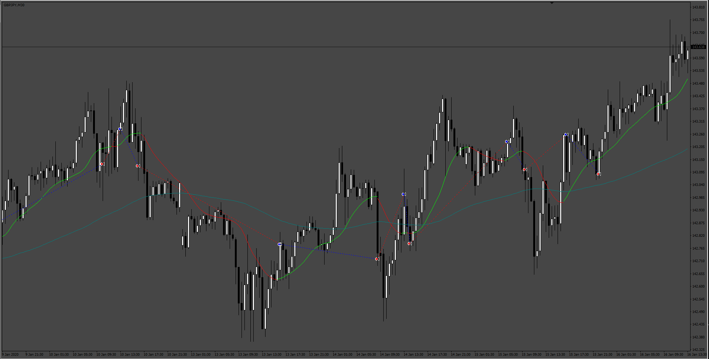
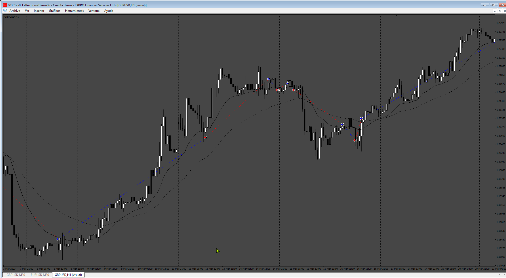

# AI_Trend_EA

> Source: https://fxcodebase.com/code/viewtopic.php?f=38&t=75174  
> Forum: 38 · Topic 75174 · 19 post(s)

---

## AI_Trend_EA

**Apprentice** · Sun Sep 01, 2024 3:58 pm

Based on the request.
[https://fxcodebase.com/code/viewtopic.p ... 42#p156442](https://fxcodebase.com/code/viewtopic.php?f=38&t=75143&p=156442#p156442)

 [AI_Trend_Navigator.mq4](files/156558/AI_Trend_Navigator.mq4)

 [AI_Trend_EA.mq4](files/156558/AI_Trend_EA.mq4)

---

## Re: AI_Trend_EA

**bijay264** · Mon Sep 02, 2024 2:16 am

please add in EA
mode open trades entry instant or every candle

open trade immediately on current signal WHEN KNN CLASSIFIER LINE GREEN IS OPEN BUY TRADE
WHEN KNN CLASSIFIER LINE RED IS OPEN SELL TRADE immediately WHEN attach EA IN CHART

CLOSE ALL OPEN OR PENDING TRADE BEFORE CLOSE META TRADER

IF DAILY LIMIT REACH PROFIT/LOSS LIMIT THEN CLOSE META TRADER (TRUE OF FALSE)

---

## Re: AI_Trend_EA

**Apprentice** · Sun Sep 08, 2024 4:09 pm

We have added your request to the development list.
Development reference 702

---

## Re: AI_Trend_EA

**Apprentice** · Tue Sep 10, 2024 11:42 am

Try this version.

 [AI_Trend_EA_v2.mq4](files/156646/AI_Trend_EA_v2.mq4)

---

## Re: AI_Trend_EA

**bijay264** · Wed Sep 11, 2024 1:01 am

sir entry mode market is not working

please add in EA
mode open trades entry instant or every candle

open trade immediately on current signal WHEN KNN CLASSIFIER LINE GREEN IS OPEN BUY TRADE
WHEN KNN CLASSIFIER LINE RED IS OPEN SELL TRADE immediately WHEN attach EA IN CHART

---

## Re: AI_Trend_EA

**bijay264** · Fri Sep 13, 2024 12:26 am

TAKE A TRADE instant OF CURRENT SIGNAL IF BUY THEN OPEN BUY TRADE
IF SELL THEN OPEN SELL TRADE INSTANT WHEN attach EA IN CHART

if no trade is running on chart then open the trade instant OF CURRENT SIGNAL any time
if KNN CLASSIFIER LINE GREEN IS OPEN BUY TRADE
if KNN CLASSIFIER LINE RED IS OPEN SELL TRADE

if buy trade close on opposite signal then sell trade open instant
if sell trade close on opposite signal then buy trade open instant
please add open trade on every candle

---

## Re: AI_Trend_EA

**Appu264** · Fri Sep 13, 2024 8:43 am

sir i used ur ai trend EA is good but please change in EA little bit is more perfect

just focus on KNN LINE COLOR GREEN FOR BUY AND RED FOR SELL
if no running trade in chart open trade immediately on current signal
if KNN CLASSIFIER LINE GREEN IS OPEN BUY TRADE instant (immediately)
if KNN CLASSIFIER LINE RED IS OPEN SELL TRADE instant (immediately)

PLEASE SEE IN PIC
mode open trades entry instant or every candle

i have notice close on opposite is not working please fix it
 if KNN CLASSIFIER LINE GREEN is turn into red then close all buy trade instant (immediately)
and open sell trade instant (immediately) == Close On Opposite == (TRUE OF FALSE)

if KNN CLASSIFIER LINE RED is turn into green then close all sell trade instant (immediately)
and open buy trade instant (immediately) == Close On Opposite == (TRUE OF FALSE)

---

## Re: AI_Trend_EA

**Apprentice** · Sat Sep 14, 2024 3:32 am

We have added your request to the development list.
Development reference 706

---

## Re: AI_Trend_EA

**Apprentice** · Sat Oct 12, 2024 12:44 pm

Try this version.

 [AI_Trend_EA_v3.mq4](files/156960/AI_Trend_EA_v3.mq4)

---

## Re: AI_Trend_EA

**Satya264** · Mon Oct 14, 2024 12:41 am

close on opposite is not working please fix it

---

## Re: AI_Trend_EA

**rickCreations** · Mon Oct 14, 2024 12:19 pm

> **Apprentice wrote:**
>
>
> Close_On_Opposite.png
>
>
> Try this version.
>
>
> AI_Trend_EA_v3.mq4

requesting v3 mq5 for mt5 version and indicator in mq5 .

reason for request :
better backtesting in mt5

---

## Re: AI_Trend_EA

**Satya264** · Wed Oct 16, 2024 7:24 am

Sir please make it normal EA
ONE BY ONE TRADE BUY AND SELL

IF KNN LINE IS RED THEN OPEN SELL TRADE
IF KNN LINE IS GREEN THEN OPEN BUY TRADE
CLOSE ON OPPOSITE
IF BUY TRADE CLOSE ON OPPOSITE OPEN SELL TRADE
IF SELL TRADE CLOSE ON OPPOSITE OPEN BUY TRADE
OPEN TRADE( ANY TIME)IF NO TRADE RUN ON CHART (ANY TIME)
TP SL TSL BREAK EVEN

---

## Re: AI_Trend_EA

**Unathi** · Wed Oct 16, 2024 10:53 am

Sir I am requesting a EI trend EA in mq5

---

## Re: AI_Trend_EA

**Karimrjh** · Thu Oct 17, 2024 7:33 am

I believe the Expert Advisor is still not functioning perfectly. Sometimes, sell signals (red line) are displayed, but no trade is executed. Additionally, the ‘close on opposite signal’ feature is not working optimally either. Could you please check everything again and ensure that a trade is immediately opened when the line switches from green to red or vice versa? Thank you!

---

## Re: AI_Trend_EA

**Maximusrex70** · Thu Oct 17, 2024 8:09 am

It seems like a good product, however I can't get it to work, it only opens the first operation, when it activates, then nothing!!??

---

## Re: AI_Trend_EA

**Karimrjh** · Thu Oct 17, 2024 11:09 am

The Expert Journal states that the Ai_Trend_Navigator indicator is too slow. Rewrite the indicator.
What could we do, to solve this Problem?

---

## Re: AI_Trend_EA

**Apprentice** · Thu Oct 17, 2024 4:52 pm

We have added your request to the development list.
Development reference 779

---

## Re: AI_Trend_EA

**Apprentice** · Mon Nov 04, 2024 5:01 am

 

 

 [AI_Trend_EA_v3.mq4](files/157171/AI_Trend_EA_v3.mq4)

---

## Re: AI_Trend_EA

**Apprentice** · Wed Dec 31, 2025 10:30 am

TAsk 780

 [AI_Trend_EA_v4.mq4](files/161469/AI_Trend_EA_v4.mq4)
