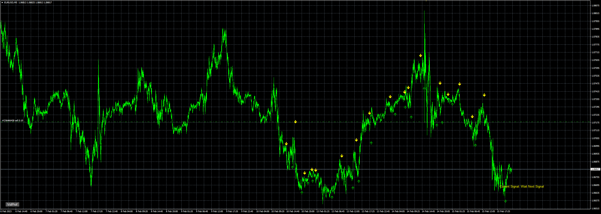

# AIzig

> Source: https://fxcodebase.com/code/viewtopic.php?f=38&t=73384  
> Forum: 38 · Topic 73384 · 9 post(s)

---

## AIzig

**Apprentice** · Wed Feb 15, 2023 3:28 pm

Based on the request.
[https://fxcodebase.com/code/viewtopic.php?f=38&t=73368](https://fxcodebase.com/code/viewtopic.php?f=38&t=73368)

The SL value calculated by the signal candle's High/Low +/- "SL_add_pips" value (in the inputs tab). We added a 1:1 RR calculation for TP: Close +/- SL distance.

 [AIzig.mq4](files/149648/AIzig.mq4)

---

## Re: AIzig

**mhlangak** · Thu Feb 16, 2023 6:25 am

Thank you so much I'd like to request you to convert this indicator to mt5 also with same setting including period setting

---

## Re: AIzig

**HestoriiafxInc** · Mon Feb 20, 2023 4:44 pm

Hey coders Please convert indicator to Mt5

---

## Re: AIzig

**Apprentice** · Wed Feb 22, 2023 2:53 am

We have added your request to the development list.
Development reference 157.

---

## Re: AIzig

**mhlangak** · Fri Mar 10, 2023 1:15 am

> **Apprentice wrote:**
> We have added your request to the development list.
> Development reference 157.

If i may ask Is this still under development

---

## Re: AIzig

**Maik12q45pok** · Mon Aug 21, 2023 11:43 am

hello mr. Jemic. Hope you or somebody of the staff can help us(me)

the AIzig i a great indicator!

aswell it is possible to get the AIzig with an mql4 file with settings explaination cause in the curent one it isnt full possible to understand each code line!

but i have see something what maybe be changeable:

when we set the AIzig on a regualr 1min chart for example and set ( we ignore all except gup size setting) gup into value of 1 we become much signals! when we enter the gup size into 6 for example we become longer trends but with an offset of candles in comparing with input value 1

my question is: it is possible to get this kind of signals instead of this: see picture!

maybe with an count how many bars(signals) are ignore or how will it be possible?

thanks a lot - of course i will be honor this work with an donation

---

## Re: AIzig

**Apprentice** · Wed Aug 23, 2023 3:14 am

We have added your request to the development list.
Development reference 749.

---

## Re: AIzig

**Maik12q45pok** · Thu Aug 24, 2023 7:41 am

what i have also found out is, that the AIzig works with ibands calling Bollingerbands it seems on default setting (periode 20) and Zigzag indicator!

---

## Re: AIzig

**Apprentice** · Mon Aug 25, 2025 3:56 am

 [AIzig.mq5](files/160351/AIzig.mq5)
