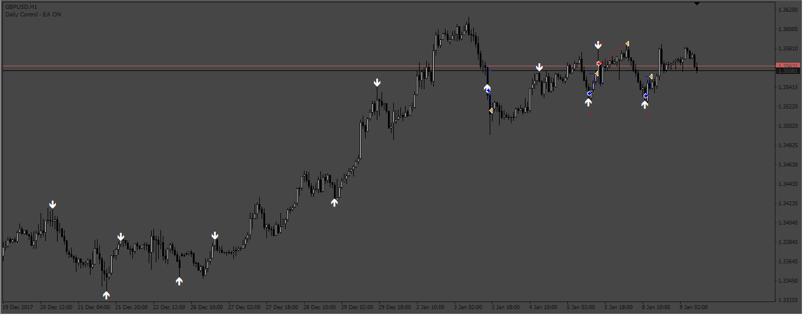
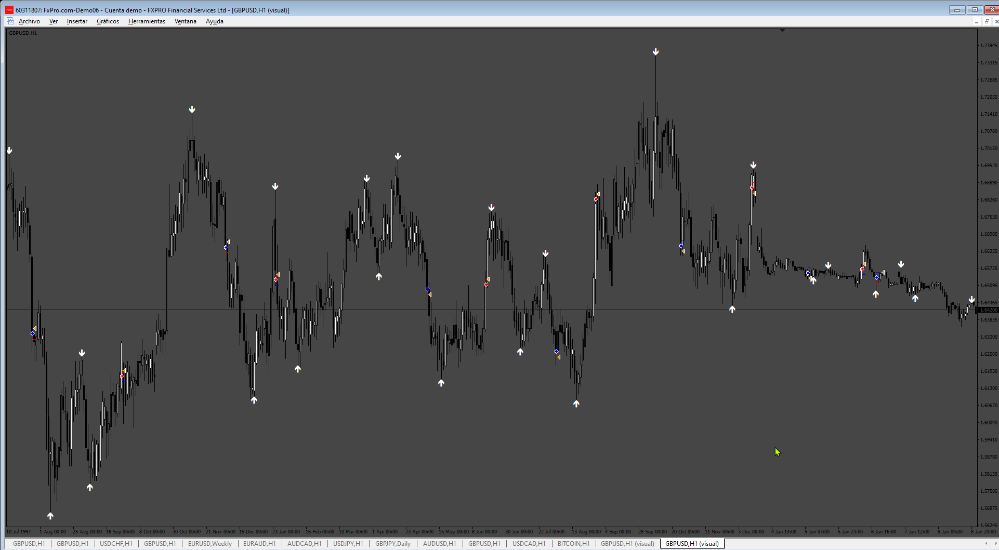

# AJ_ARROW EA

> Source: https://fxcodebase.com/code/viewtopic.php?f=38&t=73872  
> Forum: 38 · Topic 73872 · 4 post(s)

---

## AJ_ARROW EA

**Apprentice** · Mon Jun 26, 2023 3:13 pm

Based on the request.
[https://fxcodebase.com/code/viewtopic.php?f=27&p=151174](https://fxcodebase.com/code/viewtopic.php?f=27&p=151174)

 [AJ_ARROW.mq4](files/151422/AJ_ARROW.mq4)

 [AJ_ARROW EA.mq4](files/151422/AJ_ARROW%20EA.mq4)

---

## Re: AJ_ARROW EA

**povznak** · Mon Jan 06, 2025 8:30 am

> **Apprentice wrote:**
>
>
> 525pic.png
>
>
> Based on the request.
> [https://fxcodebase.com/code/viewtopic.php?f=27&p=151174](https://fxcodebase.com/code/viewtopic.php?f=27&p=151174)
>
>
> AJ_ARROW.mq4
>
>
>
>
> AJ_ARROW EA.mq4

Good afternoon,there is any chance of fixing this EA to give a test on it? it doesnt take trades at all after compiled.
Best Regards,thanks.

---

## Re: AJ_ARROW EA

**Apprentice** · Sun Jan 12, 2025 12:56 pm

We have added your request to the development list.
Development reference 34

---

## Re: AJ_ARROW EA

**Apprentice** · Mon Jan 20, 2025 4:35 pm

 [AJ_ARROW_EA.mq4](files/157928/AJ_ARROW_EA.mq4)
