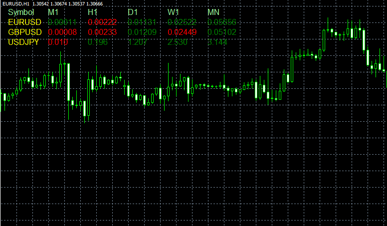

# All ATRs script

> Source: https://fxcodebase.com/code/viewtopic.php?f=38&t=32553  
> Forum: 38 · Topic 32553 · 1 post(s)

---

## All ATRs script

**Alexander.Gettinger** · Thu Feb 28, 2013 5:50 pm

The script shows the values of ATR on all instruments (from market watch) at different timeframes.

 

Download:

 [AllATRs.mq4](files/55450/AllATRs.mq4)
