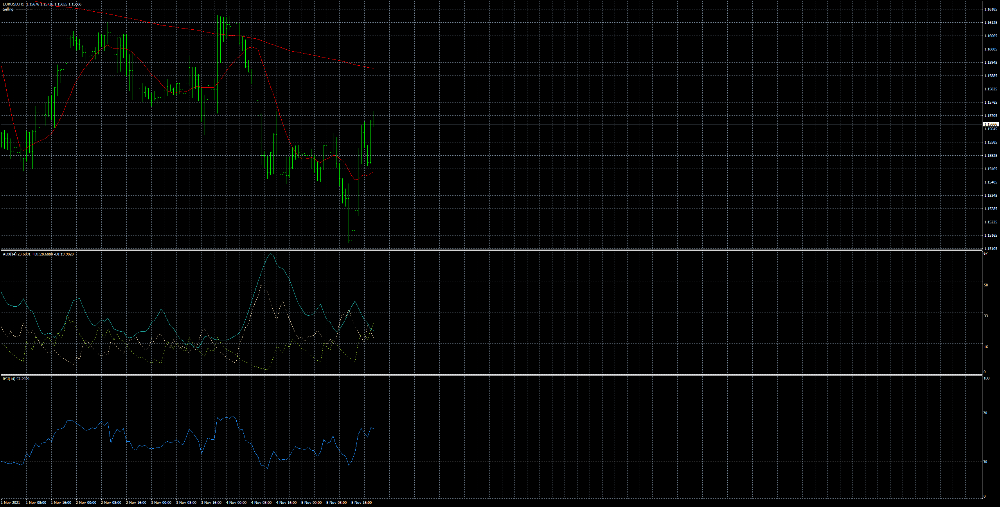
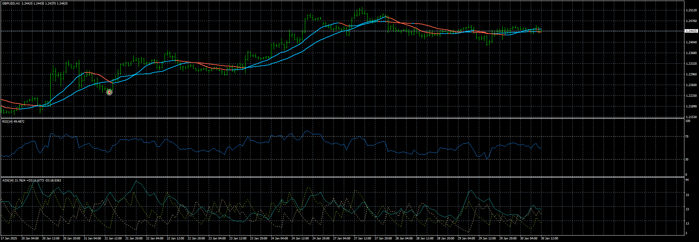

# All_Average_Ea

> Source: https://fxcodebase.com/code/viewtopic.php?f=38&t=71760  
> Forum: 38 · Topic 71760 · 5 post(s)

---

## All_Average_Ea

**Apprentice** · Mon Jan 03, 2022 6:08 am

Based on the request.
[https://fxcodebase.com/code/viewtopic.php?f=38&p=144460](https://fxcodebase.com/code/viewtopic.php?f=38&p=144460)

BUY RULE:
Fast MA crosses above Slow MA
ADX (14) > 30, ADX (14) < 45
RSI (14) > 50, RSI (14) < 70

SELL RULE:
Fast MA crosses below Slow MA
ADX (14) > 30, ADX (14) < 45
RSI (14) > 30, RSI (14) < 50

 [All_Average_Ea.mq4](files/144629/All_Average_Ea.mq4)

 [All_Average_Ea.mq5](files/144629/All_Average_Ea.mq5)

---

## Re: All_Average_Ea

**physician797** · Tue Jan 04, 2022 5:08 pm

I requested an EA based on the attached indicators. The attached indicators contain code for approximately 32 different types of moving averages. However, the EA above allows me to select from only 4 types of moving averages.

Can you please go through the request again and deliver accordingly. Thanks.

---

## Re: All_Average_Ea

**Apprentice** · Fri Jan 07, 2022 4:23 am

Your request is added to the development list.
Development reference 15.

---

## Re: All_Average_Ea

**Dhenmas2110** · Sun Jan 09, 2022 12:51 am

hallo, can you add limiter only once entry.?
thank you

---

## Re: All_Average_Ea

**Apprentice** · Thu Jan 30, 2025 5:16 am

 [All Averages 4.9.mq4](files/158058/All%20Averages%204.9.mq4)

 [All_Averages_EA.mq4](files/158058/All_Averages_EA.mq4)

 [All Averages 4.9.mq5](files/158058/All%20Averages%204.9.mq5)

 [All_Averages_EA.mq5](files/158058/All_Averages_EA.mq5)
