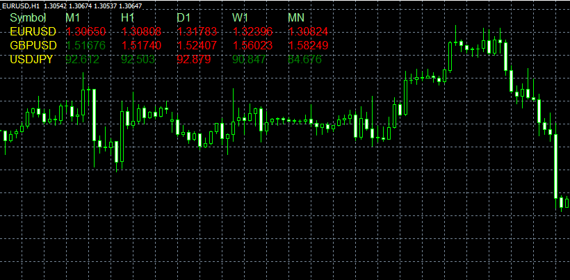

# All MAs script

> Source: https://fxcodebase.com/code/viewtopic.php?f=38&t=32554  
> Forum: 38 · Topic 32554 · 1 post(s)

---

## All MAs script

**Alexander.Gettinger** · Thu Feb 28, 2013 5:51 pm

The script shows the values of moving average on all instruments (from market watch) at different timeframes.

 

Download:

 [AllMAs.mq4](files/55451/AllMAs.mq4)
