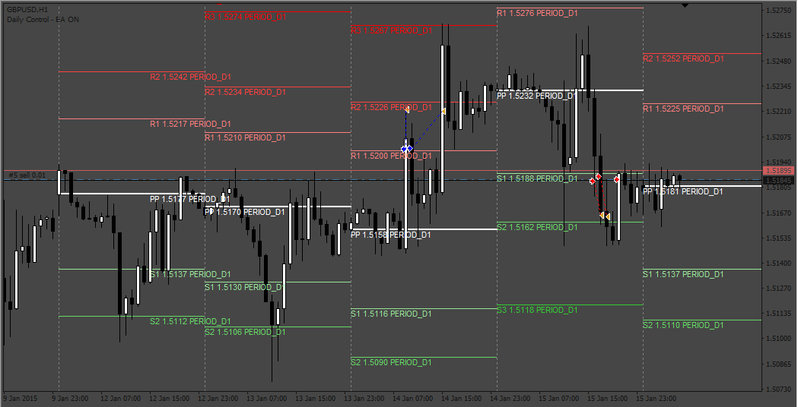
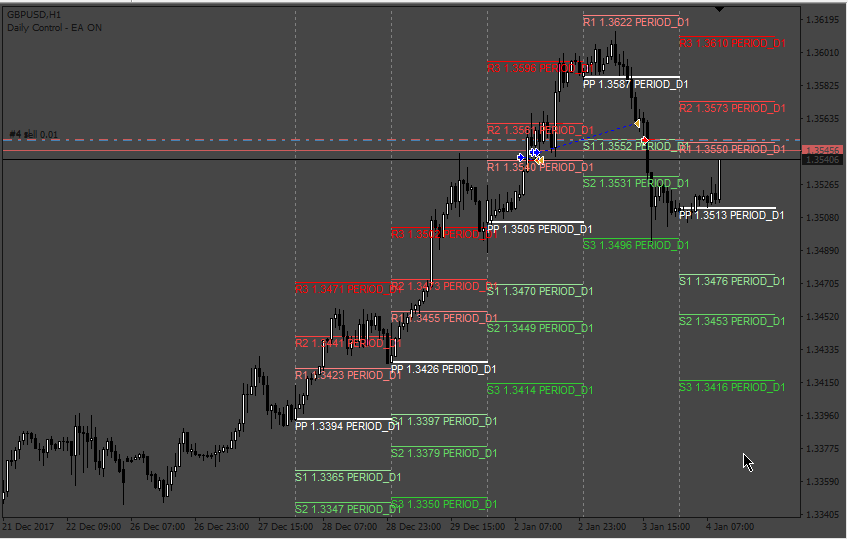
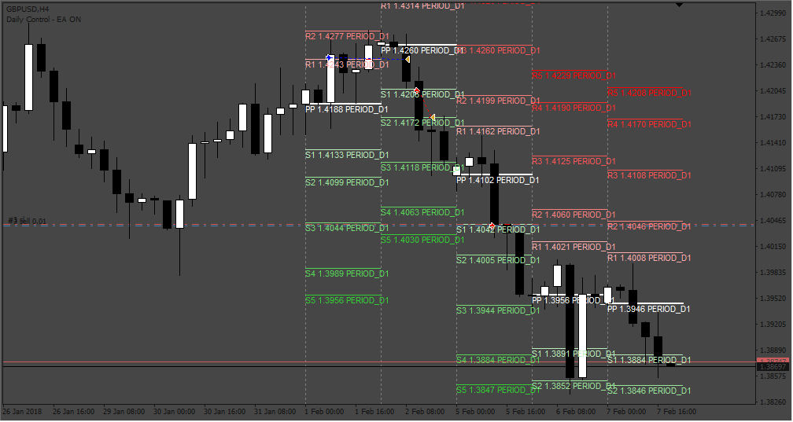
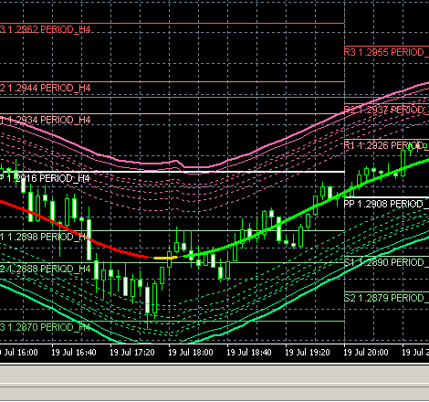
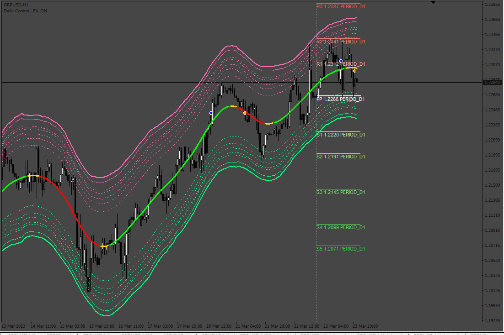

# All_Pivots_ea

> Source: https://fxcodebase.com/code/viewtopic.php?f=38&t=73750  
> Forum: 38 · Topic 73750 · 10 post(s)

---

## All_Pivots_ea

**Apprentice** · Sat May 20, 2023 1:43 am

Based on the request.
[https://fxcodebase.com/code/viewtopic.php?f=39&p=150883](https://fxcodebase.com/code/viewtopic.php?f=39&p=150883)

 [AllPivots_v5.4_600+.mq4](files/150924/AllPivots_v5.4_600.mq4)

 [All_Pivots_ea.mq4](files/150924/All_Pivots_ea.mq4)

---

## Re: All_Pivots_ea

**merlin1331** · Tue Jun 13, 2023 12:51 pm

admin, can you add conditions for this ea?

 if price above r2 line , the new stoploss will be modify to the orderopenprice with x pips,
 if price above r3 line, the new stoploss will be modify to the r2 line price.

 vise versa for s2, s3 line conditions.

this new stoploss trailing function can be turn on or off.

---

## Re: All_Pivots_ea

**Apprentice** · Thu Jun 15, 2023 5:43 am

We have added your request to the development list.
Development reference 535.

---

## Re: All_Pivots_ea

**Apprentice** · Tue Jun 20, 2023 12:45 pm

 [All_Pivots_ea_v2.mq4](files/151312/All_Pivots_ea_v2.mq4)

---

## Re: All_Pivots_ea

**merlin1331** · Sat Jun 24, 2023 2:29 pm

Admin, thanks for your team ‘s good work.
Can be add this conditions?
Only one order within currently fibo period .session.

For example below image:

The current fibo h4 line session, it open an order and closed . after that, it open another order again. It is not good.

So I need one order , after it closed, do not open order within current fibo h4 line session. After the new fibo h4 line session begin, it can open new order.

---

## Re: All_Pivots_ea

**Apprentice** · Sat Jul 01, 2023 6:23 am

We have added your request to the development list.
Development reference 582.

---

## Re: All_Pivots_ea

**Apprentice** · Tue Jul 11, 2023 2:30 am

 [All_Pivots_ea_v3.mq4](files/151586/All_Pivots_ea_v3.mq4)

---

## Re: All_Pivots_ea

**merlin1331** · Wed Jul 19, 2023 3:13 pm

admin, please add conditions for this ea.

 

*see picture*

if tma atr channel middle line turns yellow or green , sell order close.
if tma atr channel middle line turns yellow or red, buy order close.

---

## Re: All_Pivots_ea

**Apprentice** · Thu Jul 20, 2023 1:57 pm

We have added your request to the development list.
Development reference 617.

---

## Re: All_Pivots_ea

**Apprentice** · Tue Aug 01, 2023 5:32 pm

 [All_Pivots_ea_v4.mq4](files/151887/All_Pivots_ea_v4.mq4)
