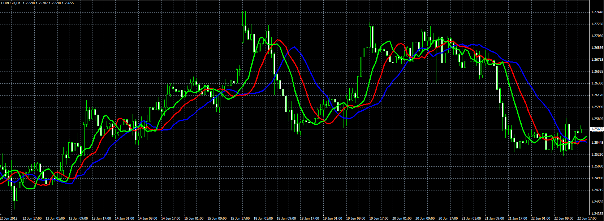

# Alligator with VAMA

> Source: https://fxcodebase.com/code/viewtopic.php?f=38&t=20489  
> Forum: 38 · Topic 20489 · 1 post(s)

---

## Alligator with VAMA

**Alexander.Gettinger** · Fri Jun 22, 2012 2:27 pm

Original indicator: [viewtopic.php?f=17&t=7186](https://fxcodebase.com/code/viewtopic.php?f=17&t=7186)

This is a standard alligator uses VAMA instead of moving averages.

 

Download:

 [Alligator_With_VAMA.mq4](files/35913/Alligator_With_VAMA.mq4)

For this alligator must be installed VAMA indicator ([viewtopic.php?f=38&t=20488](https://fxcodebase.com/code/viewtopic.php?f=38&t=20488)).
