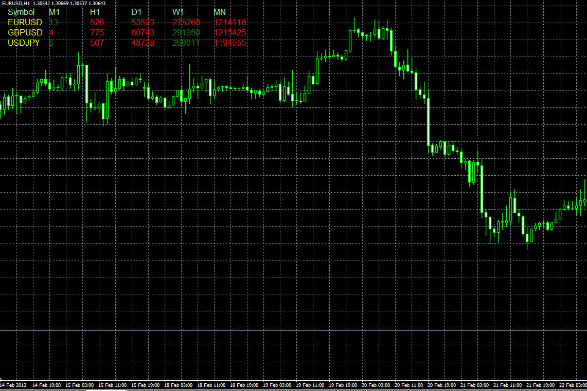

# AllVolumes script

> Source: https://fxcodebase.com/code/viewtopic.php?f=38&t=32552  
> Forum: 38 · Topic 32552 · 4 post(s)

---

## AllVolumes script

**Alexander.Gettinger** · Thu Feb 28, 2013 5:46 pm

The script shows the volume on all instruments (from market watch) at different timeframes.

 

Download:

 [AllVolumes.mq4](files/55449/AllVolumes.mq4)

---

## Re: AllVolumes script

**speakinmymind** · Fri Mar 01, 2013 10:45 am

is there a .lua version of this yet?

---

## Re: AllVolumes script

**Apprentice** · Mon Mar 04, 2013 5:35 am

Try this version.
[viewtopic.php?f=17&t=32684](https://fxcodebase.com/code/viewtopic.php?f=17&t=32684)

---

## Re: AllVolumes script

**speakinmymind** · Mon Mar 04, 2013 4:13 pm

Thanks!
