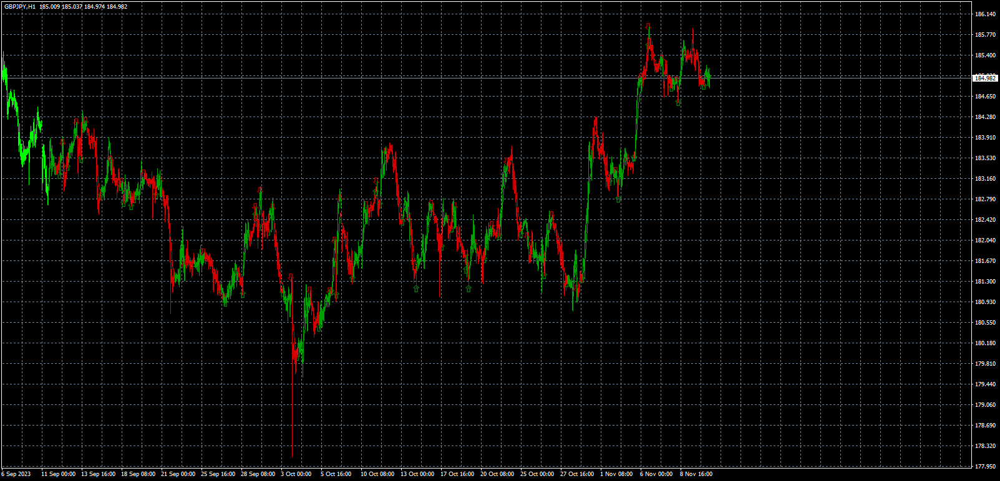
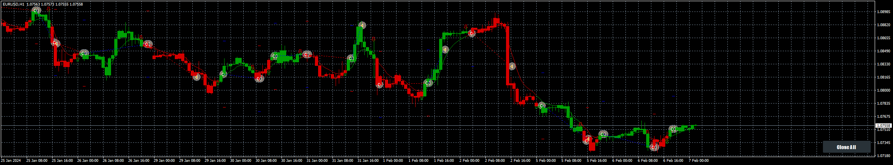

# ALMA_Smoothed_Gaussian_Moving_Average

> Source: https://fxcodebase.com/code/viewtopic.php?f=38&t=74551  
> Forum: 38 · Topic 74551 · 5 post(s)

---

## ALMA_Smoothed_Gaussian_Moving_Average

**Apprentice** · Sat Jan 20, 2024 2:33 am

Based on the request.
[https://fxcodebase.com/code/viewtopic.php?f=38&t=74240](https://fxcodebase.com/code/viewtopic.php?f=38&t=74240)

 [ALMA_Smoothed_Gaussian_Moving_Average.mq4](files/154109/ALMA_Smoothed_Gaussian_Moving_Average.mq4)

 

 [ALMA_Smoothed_Gaussan_MA_EA_v1.00.mq4](files/154109/ALMA_Smoothed_Gaussan_MA_EA_v1.00.mq4)

---

## Re: ALMA_Smoothed_Gaussian_Moving_Average

**topntown** · Sun Jan 28, 2024 12:37 am

PLEASE UPDATE ABOUT EA

---

## Re: ALMA_Smoothed_Gaussian_Moving_Average

**Apprentice** · Tue Feb 06, 2024 12:54 pm

We have added your request to the development list.
Development reference 133

---

## Re: ALMA_Smoothed_Gaussian_Moving_Average

**Apprentice** · Tue Feb 06, 2024 7:18 pm

Finished as task 935
[https://fxcodebase.com/code/viewtopic.php?f=38&t=74551](https://fxcodebase.com/code/viewtopic.php?f=38&t=74551)

---

## Re: ALMA_Smoothed_Gaussian_Moving_Average

**Apprentice** · Tue Feb 06, 2024 7:25 pm

ALMA_Smoothed_Gaussan_MA_EA_v1.00.mq4
