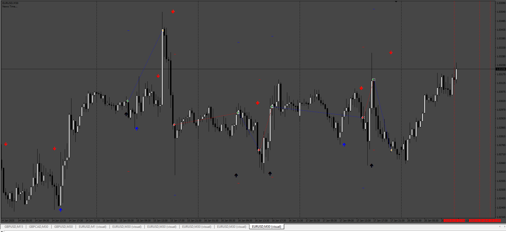

# ALPHA_TREND_EA

> Source: https://fxcodebase.com/code/viewtopic.php?f=38&t=76266  
> Forum: 38 · Topic 76266 · 5 post(s)

---

## ALPHA_TREND_EA

**Apprentice** · Mon Aug 25, 2025 4:17 am

The [http://calendar.fxstreet.com/](http://calendar.fxstreet.com/) link should be present in the MT4 settings
(Options -> Expert Advisors -> Allow WebRequest for listed URL).
There is a popup alert if it’s missing, but that doesn’t work in the tester.
I’ll go ahead and change it so that instead of the news it displays a message saying the link must be added.

 [ALPHA_TREND_EA_v1.01.mq4](files/160356/ALPHA_TREND_EA_v1.01.mq4)

---

## Re: ALPHA_TREND_EA

**xmixers** · Thu Aug 28, 2025 10:06 pm

sorry brother
can you provide the indicator ALPHA_TREND
thank you very much

---

## Re: ALPHA_TREND_EA

**Apprentice** · Sun Aug 31, 2025 3:34 am

We have added your request to the development list.
Development reference 553

---

## Re: ALPHA_TREND_EA

**Apprentice** · Fri Sep 05, 2025 3:24 am

 [ALPHA_TREND_EA_v1.01.mq4](files/160477/ALPHA_TREND_EA_v1.01.mq4)

---

## Re: ALPHA_TREND_EA

**valseyuk** · Sat Sep 06, 2025 8:40 am

the EA doesnt work without the indicator ALPHA_TREND
