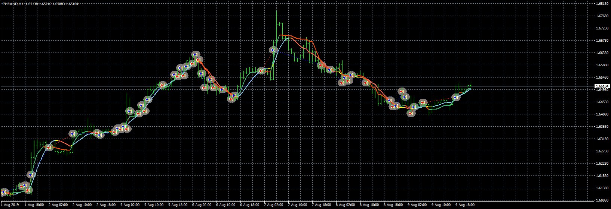
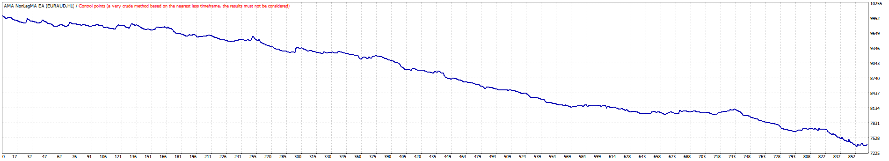

# AMA NonLagMA EA

> Source: https://fxcodebase.com/code/viewtopic.php?f=38&t=70070  
> Forum: 38 · Topic 70070 · 1 post(s)

---

## AMA NonLagMA EA

**Apprentice** · Thu Jun 25, 2020 4:48 am

 

Based on request.
[viewtopic.php?f=27&t=70051](https://fxcodebase.com/code/viewtopic.php?f=27&t=70051)

 [AMA NonLagMA EA.mq4](files/135260/AMA%20NonLagMA%20EA.mq4)

 [AMA.mq4](files/135260/AMA.mq4)

 [nonlagma-indicator.mq4](files/135260/nonlagma-indicator.mq4)
