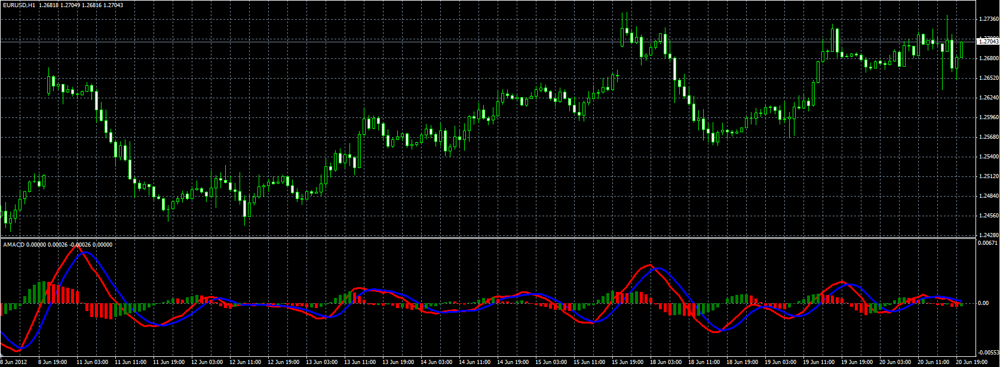

# AMACD

> Source: https://fxcodebase.com/code/viewtopic.php?f=38&t=20434  
> Forum: 38 · Topic 20434 · 1 post(s)

---

## AMACD

**Alexander.Gettinger** · Wed Jun 20, 2012 3:57 pm

MACD based on AMA ([viewtopic.php?f=38&t=20223](https://fxcodebase.com/code/viewtopic.php?f=38&t=20223)).

Formulas:
MACD=AMA(Short)-AMA(Long),
Signal=SMA(MACD),
Histogram=MACD-Signal.

 

Download:

 [AMACD.mq4](files/35828/AMACD.mq4)

For AMACD must be installed AMA indicator ([viewtopic.php?f=38&t=20223](https://fxcodebase.com/code/viewtopic.php?f=38&t=20223)).
