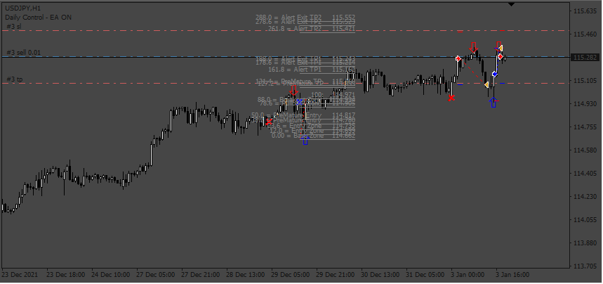
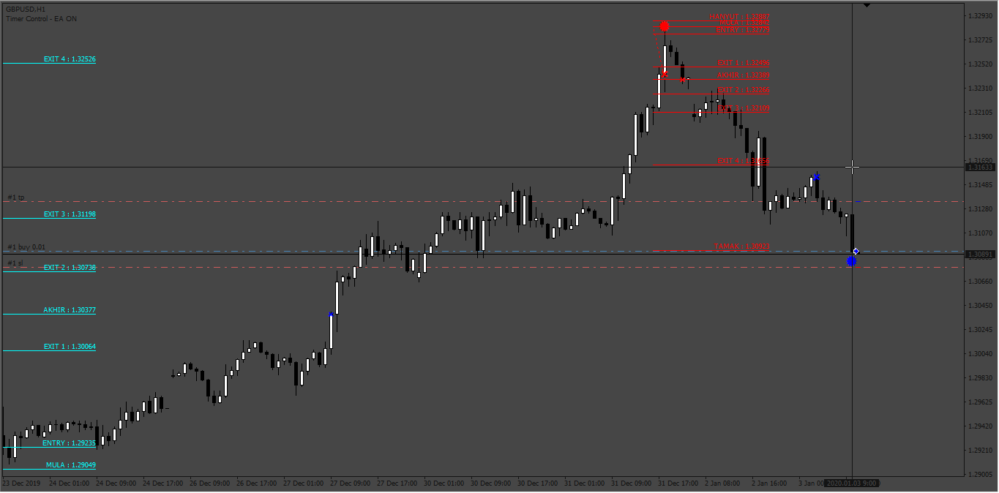
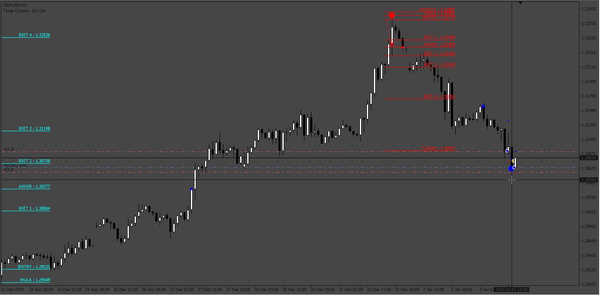
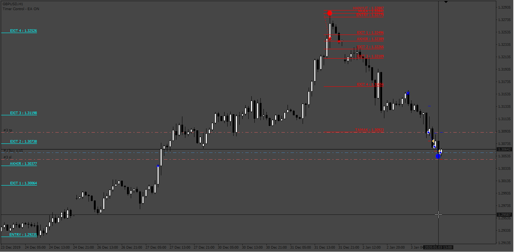
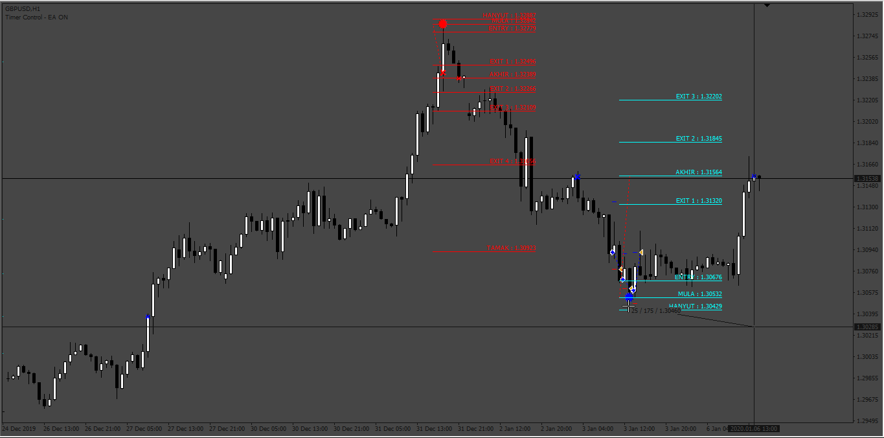

# Amazing_Fibo_EA

> Source: https://fxcodebase.com/code/viewtopic.php?f=38&t=74460  
> Forum: 38 · Topic 74460 · 4 post(s)

---

## Amazing_Fibo_EA

**Apprentice** · Wed Dec 20, 2023 2:56 am

Based on the request.
[https://fxcodebase.com/code/viewtopic.php?f=27&p=153589](https://fxcodebase.com/code/viewtopic.php?f=27&p=153589)

 [Fibo_Musang.ex4](files/153739/Fibo_Musang.ex4)

 [JerryFmcbr.ex4](files/153739/JerryFmcbr.ex4)

 [Amazing_Fibo_EA.mq4](files/153739/Amazing_Fibo_EA.mq4)

---

## Re: Amazing_Fibo_EA

**righvex** · Wed May 01, 2024 7:03 am

Hi admin. Thanks for our effort. Have several problems. The EA did not entry base on Indicators. EA should Entry (BUY/SELL) on ENTRY LEVEL of the indicator and TP to EXIT 1, EXIT 2, EXIT 3 etc with 3 level TP. SL should be at the HANYUT level.

Here i give you the Image and how its should work. Also i attach the Indicators in MQ4 so you can see the code.

 Hope to hear from you soon. Thanks in advanced!

---

## Re: Amazing_Fibo_EA

**Apprentice** · Fri May 10, 2024 7:04 am

We have added your request to the development list.
Development reference 378

---

## Re: Amazing_Fibo_EA

**Apprentice** · Fri May 17, 2024 12:55 pm

 

 

 

You can follow the sequence buy0, buy1, buy2

The expert worked ok, I do it again based on the new indicator provided.

The indicator is a total scam, repaints the signals all the time, impossible to make an expert based on signals from 25 candles back, it is not trustworthy.

 [FMCBR.mq4](files/155369/FMCBR.mq4)

 [Amazing_Fibo_EA.mq4](files/155369/Amazing_Fibo_EA.mq4)
