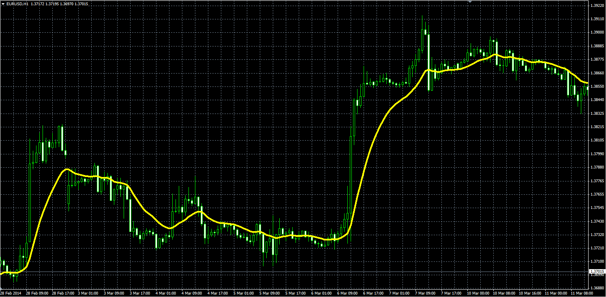

# AMMA indicator

> Source: https://fxcodebase.com/code/viewtopic.php?f=38&t=60495  
> Forum: 38 · Topic 60495 · 1 post(s)

---

## AMMA indicator

**Alexander.Gettinger** · Thu Apr 03, 2014 12:45 pm

Formula:
AMMA[i] = (AMMA[i-1]*(Length-2)+Price[i]+Price[i-1])/Length.

 

Download:

 [AMMA.mq4](files/93362/AMMA.mq4)
