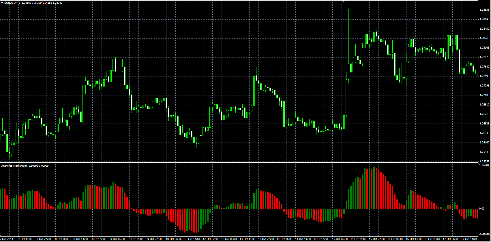

# Anchored Momentum

> Source: https://fxcodebase.com/code/viewtopic.php?f=38&t=61551  
> Forum: 38 · Topic 61551 · 1 post(s)

---

## Anchored Momentum

**Alexander.Gettinger** · Wed Nov 26, 2014 3:25 pm

Original LUA oscillator: [viewtopic.php?f=17&t=3648](https://fxcodebase.com/code/viewtopic.php?f=17&t=3648).

> The formula for the calculation of the oscillator.
> If you choose, you can replace the first moving average with closing price.
> Anchored Momentum [period] = 100*((MA_One /MA_Two)-1);

 

Download:

 [Anchored_Momentum.mq4](files/97397/Anchored_Momentum.mq4)
