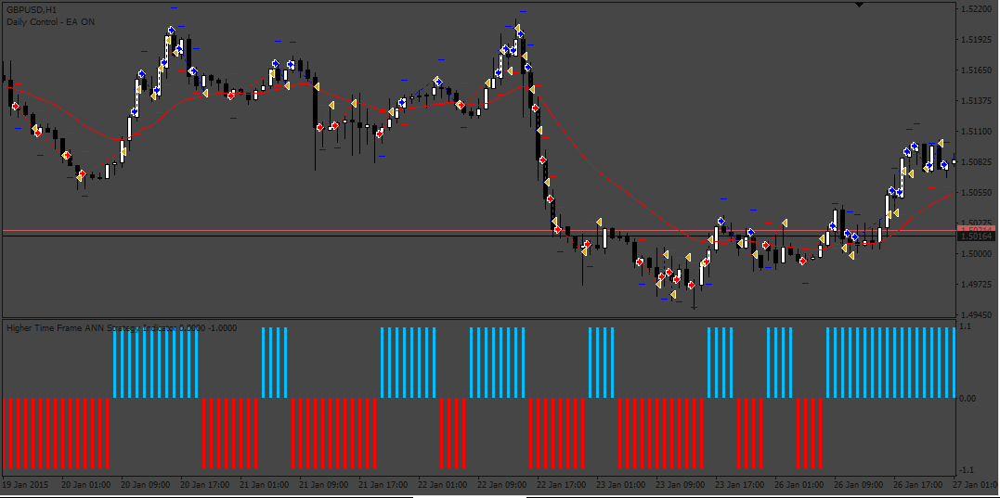
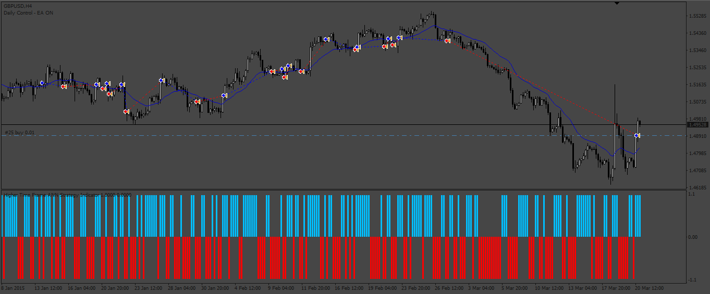

# ANN_Strategy_EA

> Source: https://fxcodebase.com/code/viewtopic.php?f=38&t=73687  
> Forum: 38 · Topic 73687 · 6 post(s)

---

## ANN_Strategy_EA

**Apprentice** · Sun May 07, 2023 3:09 am

Based on Lua version
[https://fxcodebase.com/code/viewtopic.php?f=17&t=65182](https://fxcodebase.com/code/viewtopic.php?f=17&t=65182)

 [ANN_Strategy_EA.mq4](files/150719/ANN_Strategy_EA.mq4)

Please download Higher Time Frame ANN Strategy Indicator
[https://fxcodebase.com/code/viewtopic.php?f=38&t=66491](https://fxcodebase.com/code/viewtopic.php?f=38&t=66491)

---

## Re: ANN_Strategy_EA

**Sherlock79** · Sun May 07, 2023 7:13 am

Thank you for getting this developed

Can you please check as this is placing 100s of trades every minutes, I don't want that. I want to use this as a swing trade EA. The trade should opens when the defined conditions are met and exit when the opposite signal is given by the strategy. Can you please look into it.

Thank you in well advance!

---

## Re: ANN_Strategy_EA

**Apprentice** · Tue May 09, 2023 12:40 pm

We have added your request to the development list.
Development reference 425.

---

## Re: ANN_Strategy_EA

**Apprentice** · Sat May 13, 2023 10:41 am

 [ANN_Strategy_EA_v2.mq4](files/150822/ANN_Strategy_EA_v2.mq4)

---

## Re: ANN_Strategy_EA

**rickCreations** · Sat May 13, 2023 1:24 pm

Is there anyway you can suggest settings , timeframe, currency pair : to make this EA profitable. When testing the last 5 months on icmarket on the same GBPUSD pair it isn’t profitable at all.

---

## Re: ANN_Strategy_EA

**Sherlock79** · Thu May 18, 2023 11:25 pm

Thanks a ton!
