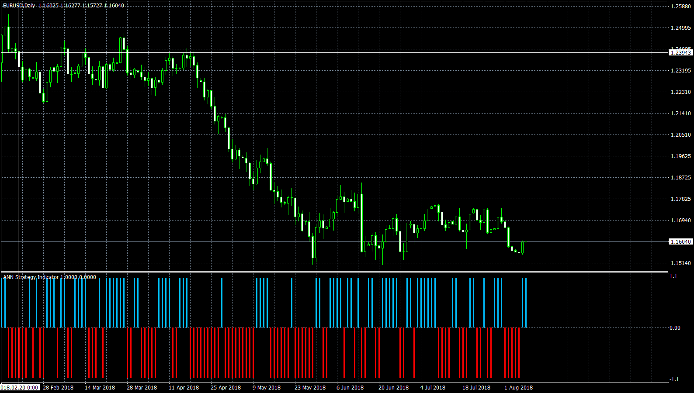

# ANN Strategy Indicator

> Source: https://fxcodebase.com/code/viewtopic.php?f=38&t=66491  
> Forum: 38 · Topic 66491 · 9 post(s)

---

## ANN Strategy Indicator

**Apprentice** · Sun Aug 12, 2018 5:08 am

Based on TS2/Lua original.
[viewtopic.php?f=17&t=65182](https://fxcodebase.com/code/viewtopic.php?f=17&t=65182)

 [Chart Time Frame ANN Strategy Indicator.mq4](files/120506/Chart%20Time%20Frame%20ANN%20Strategy%20Indicator.mq4)

 [Higher Time Frame ANN Strategy Indicator.mq4](files/120506/Higher%20Time%20Frame%20ANN%20Strategy%20Indicator.mq4)

Indicator based EA
[https://fxcodebase.com/code/viewtopic.php?f=38&t=73687](https://fxcodebase.com/code/viewtopic.php?f=38&t=73687)

---

## Re: ANN Strategy Indicator

**idreezz** · Fri Dec 13, 2019 3:05 am

Hi, thank you for the good work as always.

can you please add a the various notification alerts to both indicators, so it alerts on the new bullish indication from it an the bearish indication too.

Thank you.

---

## Re: ANN Strategy Indicator

**Apprentice** · Fri Dec 13, 2019 1:32 pm

Your request is added to the development list.
Development reference 432.

---

## Re: ANN Strategy Indicator

**idreezz** · Wed Dec 18, 2019 4:29 am

> **Apprentice wrote:**
>
>
> Chart_Time_Frame_ANN_Strategy_Indicator.mq4
>
>
>
>
> Higher_Time_Frame_ANN_Strategy_Indicator.mq4

Thank you Apprentice for everything as usual.

The alerts did not work... nothing happened and i also noticed that the indicator now lags in the sense that, price might have drawn a couple of candles but the indicator would not paint a bar as price paints a candle.

---

## Re: ANN Strategy Indicator

**Apprentice** · Thu Dec 19, 2019 11:46 am

[Chart_Time_Frame_ANN_Strategy_Indicator.mq4](files/130349/Chart_Time_Frame_ANN_Strategy_Indicator.mq4)

 [Higher_Time_Frame_ANN_Strategy_Indicator.mq4](files/130349/Higher_Time_Frame_ANN_Strategy_Indicator.mq4)

Try it now.

---

## Re: ANN Strategy Indicator

**idreezz** · Fri Dec 20, 2019 3:58 pm

> **Apprentice wrote:**
>
>
> Chart_Time_Frame_ANN_Strategy_Indicator.mq4
>
>
>
>
> Higher_Time_Frame_ANN_Strategy_Indicator.mq4
>
>
>
> Try it now.

Thank you so much. Works like a charm my friend.

Thanks a bunch.

---

## Re: ANN Strategy Indicator

**Sherlock79** · Sat Nov 04, 2023 8:39 am

Hi,

Can you please convert "Higher Time Frame ANN Strategy Indicator.mq4" to MT4

---

## Re: ANN Strategy Indicator

**Apprentice** · Sat Nov 04, 2023 10:31 am

We have added your request to the development list.
Development reference 978

---

## Re: ANN Strategy Indicator

**Apprentice** · Wed Jan 15, 2025 4:01 am

Higher Time Frame ANN Strategy Indicator.mq4 is already MT4 version
