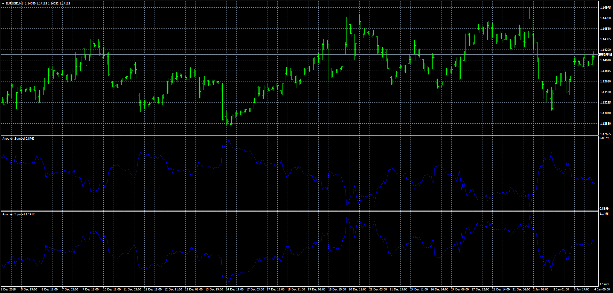

# Another_Symbol

> Source: https://fxcodebase.com/code/viewtopic.php?f=38&t=67234  
> Forum: 38 · Topic 67234 · 19 post(s)

---

## Another_Symbol

**Apprentice** · Fri Jan 04, 2019 5:59 am

 [Another_Symbol.mq4](files/123177/Another_Symbol.mq4)

 [Another_Symbol_chart_window.mq4](files/123177/Another_Symbol_chart_window.mq4)

 [Another_Symbol.mq5](files/123177/Another_Symbol.mq5)

---

## Re: Another_Symbol

**logicgate** · Fri Jan 04, 2019 6:29 am

Awesome!!!!

---

## Re: Another_Symbol

**logicgate** · Wed Oct 02, 2019 7:25 am

Hi there dear friend.

Can we have a version of this indicator where we can overlay the INDICATOR of another chart?

For example, let´s say I have a "X" indicator loaded on EURUSD chart.

Then I wanted to overlay this "X" indicator loaded on EURUSD on a Gold chart (or any other instrument). Is this possible?

---

## Re: Another_Symbol

**Apprentice** · Thu Oct 03, 2019 4:55 am

We will need to scale to be able to draw EUR / USD for XAU / USD
Use Another_Symbol_chart_window.mq4 for now.

---

## Re: Another_Symbol

**logicgate** · Thu Oct 03, 2019 7:48 am

> **Apprentice wrote:**
> We will need to scale to be able to draw EUR / USD for XAU / USD
> Use Another_Symbol_chart_window.mq4 for now.

Hi there my friend.

But that was just a random example. I wanted to be able to overlay only the indicator from another chart, in any chart.

For example, I have "X" indicator loaded on a chart of "Y" instrument. I wanted to see this "X" indicator overlaid in "A" instrument chart, in a subwindow on the bottom of chart.

---

## Re: Another_Symbol

**logicgate** · Thu Oct 03, 2019 9:37 am

I just want to confirm if you understand. It is not the price I wanna see, it is the indicator loaded on a different symbol.

---

## Re: Another_Symbol

**logicgate** · Mon Feb 01, 2021 9:34 am

Hi there mate, in the end you never replied the last question here, perhaps you forgot.

Is it possible to overlay the indicator of one chart into another chart?

For example, the volumes indicator.

If using a futures broker that offers real volumes, I would overlay the volumes from the EURUSD futures contract on the EURUSD spot instrument.

---

## Re: Another_Symbol

**Apprentice** · Thu Feb 04, 2021 7:43 am

Your request is added to the development list.
Development reference 146.

---

## Re: Another_Symbol

**Apprentice** · Sun Feb 07, 2021 6:36 pm

Unfortunately, that almost impossible to do in MT4.
 FXTS2 can do that easily.

---

## Re: Another_Symbol

**logicgate** · Sun Feb 07, 2021 6:52 pm

Ah, what a pity.

Thanks for looking into it

---

## Re: Another_Symbol

**logicgate** · Mon May 10, 2021 8:33 am

Hi there my friend, can we get a version for MT5?

---

## Re: Another_Symbol

**Apprentice** · Tue May 11, 2021 3:22 am

Your request is added to the development list.
Development reference 463.

---

## Re: Another_Symbol

**Apprentice** · Wed May 12, 2021 5:39 am

Another_Symbol.mq5 added.

---

## Re: Another_Symbol

**logicgate** · Wed May 12, 2021 4:43 pm

> **Apprentice wrote:**
> Another_Symbol.mq5 added.

Thanks my friend, but the indicator is not working. You load it on the chart and nothing happens. And yes already checked the market watch, the symbol is there and there is at least 6 months of data downloaded.

Also, to be honest I was thinking about the **Another Symbol Window**(the one that displays the symbol in a subwindow, not overlaid on the chart)

I thought you were gonna make the two versions.

If you could please do that one instead, it would be great. Thanks

---

## Re: Another_Symbol

**logicgate** · Sat May 22, 2021 4:36 am

Hello there dear friend Apprentice, you never confirmed the latest request (post above this one)

---

## Re: Another_Symbol

**Apprentice** · Tue May 25, 2021 4:04 am

Your request is added to the development list.
Development reference 510.

---

## Re: Another_Symbol

**logicgate** · Sun Jul 11, 2021 6:21 am

Hello buddy, any updates for **Development reference 510**?

Best regards

---

## Re: Another_Symbol

**logicgate** · Sat May 13, 2023 5:02 pm

Hey buddy, it seems you never fixed Another Symbol for MT5. It does not work.

Can you please look into that? Also, can you make it display candles instead of line only?

---

## Re: Another_Symbol

**logicgate** · Sun Jun 25, 2023 6:53 am

Also, besides being able to display candles, it would be great to have an option to invert the data so it's easier to make correlation analysis.
