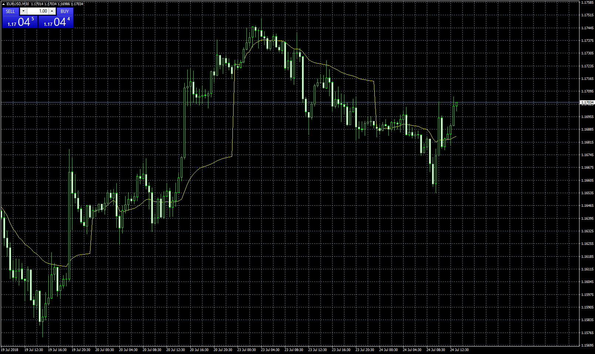
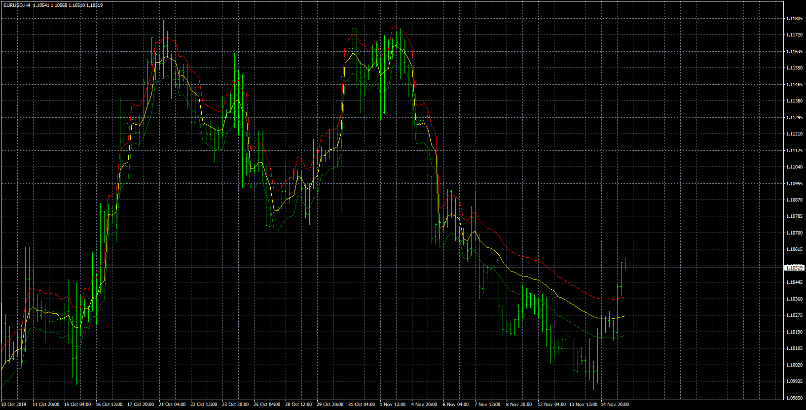

# Any Time Frame VWAP

> Source: https://fxcodebase.com/code/viewtopic.php?f=38&t=66300  
> Forum: 38 · Topic 66300 · 10 post(s)

---

## Any Time Frame VWAP

**Apprentice** · Tue Jul 24, 2018 7:52 am

TS2/Lua version
[viewtopic.php?f=17&t=65661](https://fxcodebase.com/code/viewtopic.php?f=17&t=65661)

 [Any Time Frame VWAP.mq4](files/120057/Any%20Time%20Frame%20VWAP.mq4)

---

## Re: Any Time Frame VWAP

**abedwd** · Sun Jan 05, 2020 11:27 am

Hi,

With reference to the ffg:

[viewtopic.php?f=17&t=65661](https://fxcodebase.com/code/viewtopic.php?f=17&t=65661)

Is it possible to add a "bollinger band type setting" to this indicator except that instead of the stnd.deviation setting for the upper and lower bands it is replaced with an "x amount" pips setting for the bands... so that it traces the equidistant amount of pips inputted, above and below the current vwap.

thanx in advance.

---

## Re: Any Time Frame VWAP

**Apprentice** · Mon Jan 06, 2020 8:20 am

Your request is added to the development list.
Development reference 523.

---

## Re: Any Time Frame VWAP

**Apprentice** · Wed Jan 08, 2020 6:48 am

 [Any_Time_Frame_VWAP_With_Bands.mq4](files/130625/Any_Time_Frame_VWAP_With_Bands.mq4)

---

## Re: Any Time Frame VWAP

**abedwd** · Sat Sep 26, 2020 12:56 pm

> **Apprentice wrote:**
>
>
> The attachment **eurusd-h4-forex-capital-markets.png** is no longer available
>
>
>
>
> The attachment **eurusd-h4-forex-capital-markets.png** is no longer available

Much appreciated, works perfectly! Could you do the same with the "moving average" indicator that comes standard within MT4, the one with the different MA and pricing methods as shown in the attachment, by adding bands to it with an "x amount" pips setting.

Thanks.

---

## Re: Any Time Frame VWAP

**Apprentice** · Sun Sep 27, 2020 1:48 pm

Your request is added to the development list.
Development reference 2112.

---

## Re: Any Time Frame VWAP

**Apprentice** · Mon Oct 12, 2020 2:33 am

[MA Channel.mq4](files/138212/MA%20Channel.mq4)

Try this version.

---

## Re: Any Time Frame VWAP

**abedwd** · Mon Oct 12, 2020 8:28 am

> **Apprentice wrote:**
>
>
> MA Channel.mq4
>
>
> Try this version.

Many Thanx Apprentice! Really appreciate your help and respect all that you do and share here.
Is it possible that you could please add an alert setting for price reacting at the channels.
Also, can the alert be coded with an option to be triggered as a recurring sound in addition to the normal alert message popup window.

---

## Re: Any Time Frame VWAP

**Apprentice** · Tue Oct 13, 2020 6:11 am

Your request is added to the development list.
Development reference 2186.

---

## Re: Any Time Frame VWAP

**Apprentice** · Wed Oct 14, 2020 2:29 am

[MA Channel.mq4](files/138267/MA%20Channel.mq4)

Try this version.
