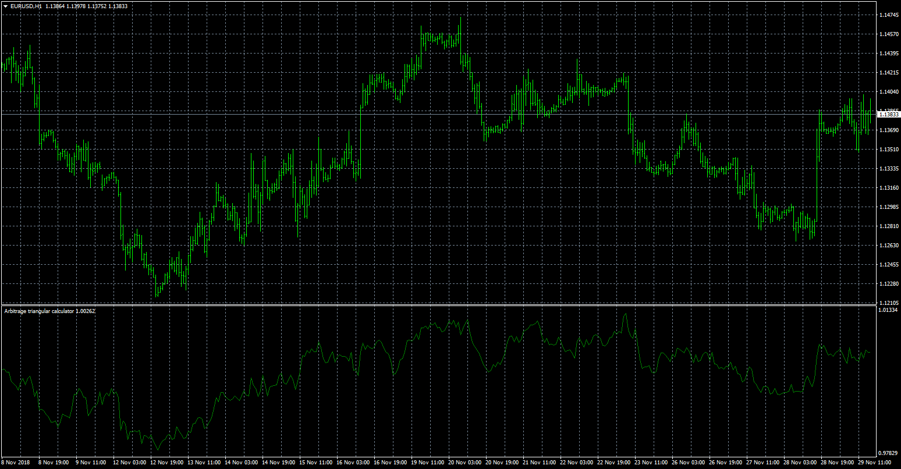

# Arbitrage_Triangular_Calculator

> Source: https://fxcodebase.com/code/viewtopic.php?f=38&t=67025  
> Forum: 38 · Topic 67025 · 1 post(s)

---

## Arbitrage_Triangular_Calculator

**Apprentice** · Thu Nov 29, 2018 1:53 pm

 [Arbitrage_Triangular_Calculator.mq4](files/122422/Arbitrage_Triangular_Calculator.mq4)

Based on TS2/Lua version.
[viewtopic.php?f=17&t=14957](https://fxcodebase.com/code/viewtopic.php?f=17&t=14957)
