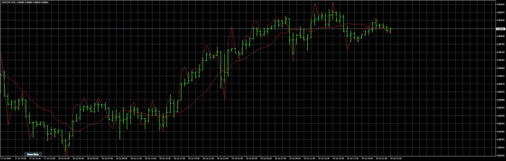

# ARIMAorMA

> Source: https://fxcodebase.com/code/viewtopic.php?f=38&t=75200  
> Forum: 38 · Topic 75200 · 1 post(s)

---

## ARIMAorMA

**Apprentice** · Tue Sep 10, 2024 12:01 pm

Based on the TS2 version.
[https://fxcodebase.com/code/viewtopic.p ... ge#p156197](https://fxcodebase.com/code/viewtopic.php?f=17&t=75084&p=156197&hilit=Autoregressive_integrated_moving_average_or_Moving_Average#p156197)

 [ARIMA.mq4](files/156651/ARIMA.mq4)

 [ARIMAorMA.mq4](files/156651/ARIMAorMA.mq4)

 [ARIMA.mq5](files/156651/ARIMA.mq5)

 [ARIMAorMA.mq5](files/156651/ARIMAorMA.mq5)
