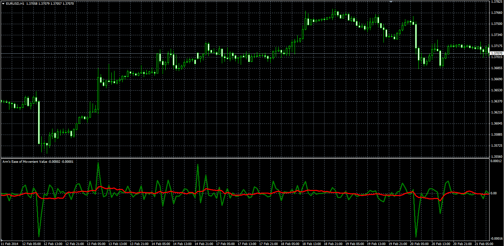

# Arm's Ease of Movement Value

> Source: https://fxcodebase.com/code/viewtopic.php?f=38&t=60492  
> Forum: 38 · Topic 60492 · 1 post(s)

---

## Arm's Ease of Movement Value

**Alexander.Gettinger** · Thu Apr 03, 2014 12:29 pm

Original LUA oscillator: [viewtopic.php?f=17&t=10454&p=21691](https://fxcodebase.com/code/viewtopic.php?f=17&t=10454&p=21691).

 

Download:

 [EMV.mq4](files/93357/EMV.mq4)
