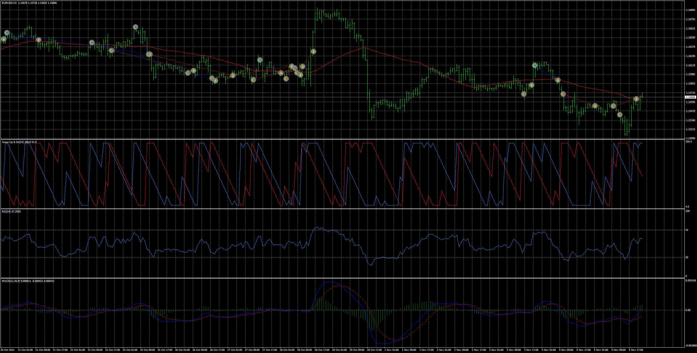

# Aroon_EMA_EA

> Source: https://fxcodebase.com/code/viewtopic.php?f=38&t=71787  
> Forum: 38 · Topic 71787 · 6 post(s)

---

## Aroon_EMA_EA

**Apprentice** · Mon Jan 10, 2022 1:55 pm

Based on the request.
[https://fxcodebase.com/code/viewtopic.php?f=27&t=71663](https://fxcodebase.com/code/viewtopic.php?f=27&t=71663)

 [Aroon_Up_Down_2.mq4](files/144710/Aroon_Up_Down_2.mq4)

 [MACD_True.mq4](files/144710/MACD_True.mq4)

 [Aroon_EMA_EA.mq4](files/144710/Aroon_EMA_EA.mq4)

---

## Re: Aroon_EMA_EA

**PhenomDC** · Thu Oct 27, 2022 8:27 am

Hello Apprentice, hope you're well. Please add an active trailing stop ("TSL ON" kind) and breakeven parameter. Thanks in advance

---

## Re: Aroon_EMA_EA

**Apprentice** · Sun Oct 30, 2022 4:24 am

We have added your request to the development list.
Development reference 692.

---

## Re: Aroon_EMA_EA

**Apprentice** · Tue Nov 08, 2022 6:29 am

[Aroon_EMA_EA.mq4](files/148210/Aroon_EMA_EA.mq4)

Try this version.

---

## Re: Aroon_EMA_EA

**puneet1979** · Mon Jul 10, 2023 11:23 pm

> **Apprentice wrote:**
>
>
> Aroon_EMA_EA.mq4
>
>
> Try this version.

Hi,

I tried optimizing but there is no option to optimize Aroon or True Macd .
Kindly look into this if there is any possibility to do that .

Thanks

---

## Re: Aroon_EMA_EA

**puneet1979** · Mon Sep 25, 2023 12:25 pm

> **puneet1979 wrote:**
>
>
> > **Apprentice wrote:**
> >
> >
> > Aroon_EMA_EA.mq4
> >
> >
> > Try this version.
>
>
>
> Hi,
>
> I tried optimizing but there is no option to optimize Aroon or True Macd .
> Kindly look into this if there is any possibility to do that .
>
> Thanks

Hi,

Did your team got the time to look into this ?

Thanks
