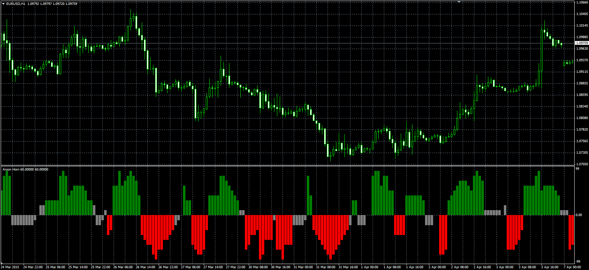
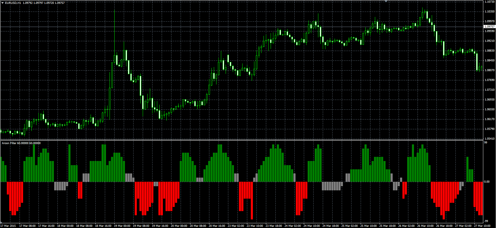

# Aroon Horn

> Source: https://fxcodebase.com/code/viewtopic.php?f=38&t=62171  
> Forum: 38 · Topic 62171 · 1 post(s)

---

## Aroon Horn

**Alexander.Gettinger** · Thu Apr 30, 2015 10:24 am

Original LUA oscillators: [viewtopic.php?f=17&t=60926](https://fxcodebase.com/code/viewtopic.php?f=17&t=60926).

Formula:
AH = 10*(Up-Dn)/Length, where
Up[i] = 100*(Length-MaxBar+i)/Length,
Dn[i] = 100*(Length-MinBar+i)/Length,
MaxBar, MinBar - positions of maximum and minimum prices at range from [i-Length+1] to [i].

 

Download:

 [Aroon_Horn.mq4](files/100178/Aroon_Horn.mq4)

**Aroon Filter:**

 

Download:

 [Aroon_Filter.mq4](files/100178/Aroon_Filter.mq4)
