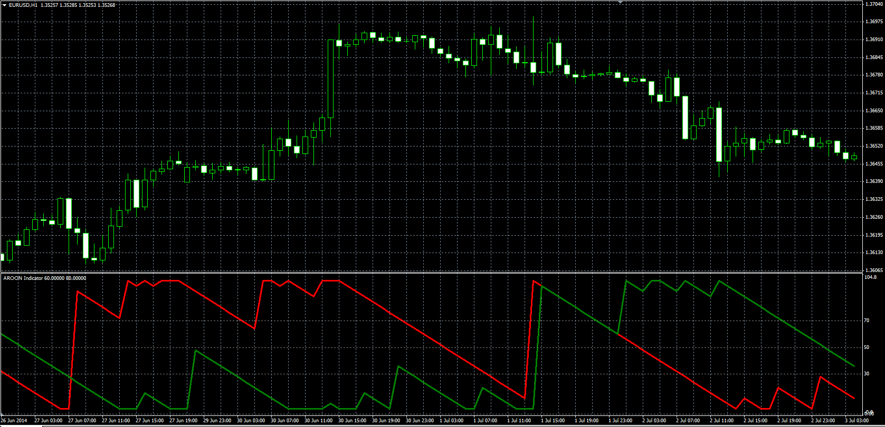

# Aroon oscillator

> Source: https://fxcodebase.com/code/viewtopic.php?f=38&t=61056  
> Forum: 38 · Topic 61056 · 1 post(s)

---

## Aroon oscillator

**Alexander.Gettinger** · Wed Aug 20, 2014 9:52 am

Description of Aroon oscillator: [http://www.investopedia.com/terms/a/aroon.asp](http://www.investopedia.com/terms/a/aroon.asp).

Formulas:
Aroon Up[i] = 100*(Length-i+PosMax)/Length,
Aroon Dn[i] = 100*(Length-i+PosMin)/Length, where
PosMax, PosMin - positions (number of bar) of maximum and minimum prices at range from (i-Length+1) to (i).

 

Download:

 [AROON.mq4](files/95441/AROON.mq4)
